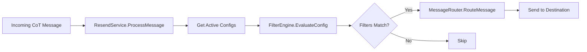
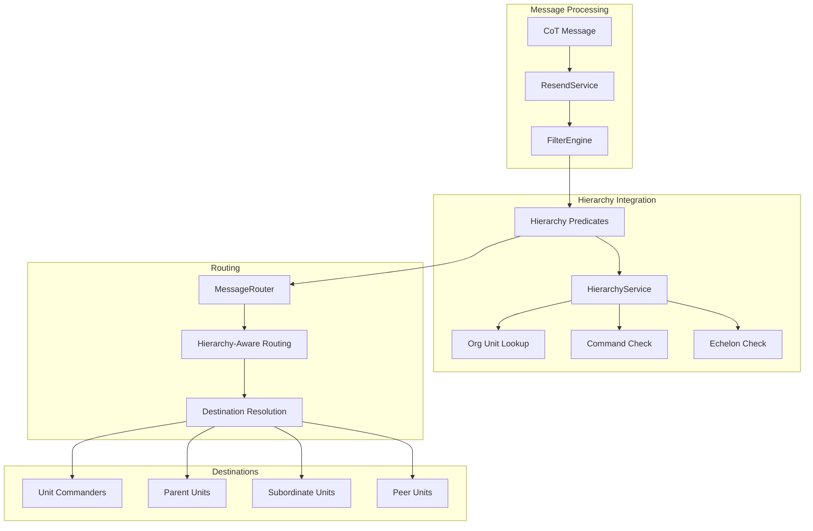

# Hierarchy of Forces - Resend Integration Design

## Executive Summary

This document details how the military hierarchy of forces system integrates with the existing resend functionality in GoATAK. The integration enables hierarchy-aware message routing, allowing messages to be filtered and forwarded based on organizational structure, command relationships, and echelon levels.

## 1. Current Resend System Overview

### 1.1 Existing Architecture

The current resend system ([`internal/resend/`](internal/resend/)) consists of:

- **ResendService** ([`service.go`](internal/resend/service.go:14)): Main orchestrator for resend functionality
- **FilterEngine** ([`filter_engine.go`](internal/resend/filter_engine.go:12)): Evaluates message filters using predicates
- **MessageRouter** ([`router.go`](internal/resend/router.go:13)): Routes messages to configured destinations
- **ConfigManager** ([`config_manager.go`](internal/resend/config_manager.go:12)): Manages resend configurations

### 1.2 Current Filter Predicates

Existing predicates include:
- `item_type`: Filter by item category (unit, drawing, contact, alert)
- `side`: Filter by affiliation (friendly, hostile, neutral, unknown)
- `unit_type`: Filter by unit type (air, ground, sea, space)
- `location_boundary`: Filter by geographic boundary

### 1.3 Message Flow



## 2. Integration Architecture

### 2.1 Enhanced System Architecture



### 2.2 Integration Points

1. **New Hierarchy Predicates**: Extend FilterEngine with hierarchy-based predicates
2. **Hierarchy-Aware Routing**: Route messages based on organizational structure
3. **Dynamic Destination Resolution**: Resolve destinations from hierarchy relationships
4. **Permission-Based Filtering**: Filter messages based on command relationships

## 3. New Hierarchy Predicates

### 3.1 Predicate Types

Add the following hierarchy-aware predicates to the filter system:

```go
// New predicate types for hierarchy filtering
const (
    PredicateOrgUnit        = "org_unit"         // Filter by organization unit
    PredicateEchelon        = "echelon"          // Filter by echelon level
    PredicateCommandLevel   = "command_level"    // Filter by command level
    PredicateParentUnit     = "parent_unit"      // Filter by parent unit
    PredicateCommandedBy    = "commanded_by"     // Filter by commander
    PredicateAttachedTo     = "attached_to"      // Filter by attachment
    PredicateInHierarchy    = "in_hierarchy"     // Filter by hierarchy membership
)
```

### 3.2 Predicate Implementations

#### 3.2.1 Organization Unit Predicate

```go
// OrgUnitPredicate filters messages by organization unit
type OrgUnitPredicate struct {
    OrgUnitUID      string
    IncludeChildren bool
    hierarchyService *hierarchy.HierarchyService
}

func (p *OrgUnitPredicate) Evaluate(msg *cot.CotMessage) bool {
    // Get item from message
    itemUID := msg.GetUID()
    
    // Get item's organization unit
    itemOrgUnit, err := p.hierarchyService.GetItemOrgUnit(itemUID)
    if err != nil {
        return false
    }
    
    // Direct match
    if itemOrgUnit == p.OrgUnitUID {
        return true
    }
    
    // Check if item's org unit is a child of target org unit
    if p.IncludeChildren {
        return p.hierarchyService.IsDescendantOf(itemOrgUnit, p.OrgUnitUID)
    }
    
    return false
}
```

#### 3.2.2 Echelon Predicate

```go
// EchelonPredicate filters messages by echelon level
type EchelonPredicate struct {
    Echelon         string   // squad, platoon, company, battalion, etc.
    Operator        string   // "equals", "above", "below"
    hierarchyService *hierarchy.HierarchyService
}

func (p *EchelonPredicate) Evaluate(msg *cot.CotMessage) bool {
    itemUID := msg.GetUID()
    
    itemEchelon, err := p.hierarchyService.GetItemEchelon(itemUID)
    if err != nil {
        return false
    }
    
    switch p.Operator {
    case "equals":
        return itemEchelon == p.Echelon
    case "above":
        return p.hierarchyService.IsEchelonAbove(itemEchelon, p.Echelon)
    case "below":
        return p.hierarchyService.IsEchelonBelow(itemEchelon, p.Echelon)
    default:
        return itemEchelon == p.Echelon
    }
}
```

#### 3.2.3 Command Relationship Predicate

```go
// CommandedByPredicate filters messages by commander
type CommandedByPredicate struct {
    CommanderUID    string
    Direct          bool  // true = direct command only, false = includes indirect
    hierarchyService *hierarchy.HierarchyService
}

func (p *CommandedByPredicate) Evaluate(msg *cot.CotMessage) bool {
    itemUID := msg.GetUID()
    
    if p.Direct {
        // Check direct command relationship
        return p.hierarchyService.IsDirectlyCommandedBy(itemUID, p.CommanderUID)
    }
    
    // Check command chain (includes indirect command)
    return p.hierarchyService.IsInCommandChainOf(itemUID, p.CommanderUID)
}
```

### 3.3 Extended FilterEngine

```go
// internal/resend/filter_engine.go - Add hierarchy support

type FilterEngine struct {
    logger           *slog.Logger
    items            repository.ItemsRepository
    hierarchyService *hierarchy.HierarchyService  // NEW: Add hierarchy service
}

// EvaluatePredicate - Extended to support hierarchy predicates
func (f *FilterEngine) EvaluatePredicate(msg *cot.CotMessage, predicate PredicateDTO) bool {
    if msg == nil {
        return false
    }
    
    switch predicate.Type {
    // Existing predicates
    case "item_type":
        p := &ItemTypePredicate{ItemType: predicate.Value}
        return p.Evaluate(msg)
    case "side":
        p := &SidePredicate{Side: predicate.Value}
        return p.Evaluate(msg)
    case "unit_type":
        p := &UnitTypePredicate{UnitType: predicate.Value}
        return p.Evaluate(msg)
    case "location_boundary":
        p := &LocationBoundaryPredicate{PolygonID: predicate.Value, items: f.items}
        return p.Evaluate(msg)
    
    // NEW: Hierarchy predicates
    case "org_unit":
        p := &OrgUnitPredicate{
            OrgUnitUID:       predicate.Value,
            IncludeChildren:  predicate.Options["include_children"].(bool),
            hierarchyService: f.hierarchyService,
        }
        return p.Evaluate(msg)
    
    case "echelon":
        p := &EchelonPredicate{
            Echelon:          predicate.Value,
            Operator:         predicate.Options["operator"].(string),
            hierarchyService: f.hierarchyService,
        }
        return p.Evaluate(msg)
    
    case "commanded_by":
        p := &CommandedByPredicate{
            CommanderUID:     predicate.Value,
            Direct:           predicate.Options["direct"].(bool),
            hierarchyService: f.hierarchyService,
        }
        return p.Evaluate(msg)
    
    default:
        f.logger.Warn("Unknown predicate type", "type", predicate.Type)
        return false
    }
}
```

### 3.4 Enhanced PredicateDTO

```go
// Extended PredicateDTO to support hierarchy options
type PredicateDTO struct {
    ID      string                 `json:"id"`
    Type    string                 `json:"type"`
    Value   string                 `json:"value"`
    Options map[string]interface{} `json:"options,omitempty"` // NEW: Additional options
}
```

## 4. Hierarchy-Aware Routing

### 4.1 Dynamic Destination Types

Add new destination types based on hierarchy:

```go
// New destination types
const (
    DestTypeNode            = "node"            // Existing: specific IP/URN
    DestTypeSubnet          = "subnet"          // Existing: subnet broadcast
    DestTypeCommander       = "commander"       // NEW: Unit commander
    DestTypeParentUnit      = "parent_unit"     // NEW: Parent organization unit
    DestTypeSubordinates    = "subordinates"    // NEW: All subordinate units
    DestTypePeerUnits       = "peer_units"      // NEW: Peer units at same echelon
    DestTypeEchelon         = "echelon"         // NEW: All units at specific echelon
)
```

### 4.2 Enhanced MessageRouter

```go
// internal/resend/router.go - Add hierarchy-aware routing

type MessageRouter struct {
    sendToDestination func(msg *cotproto.TakMessage, dest model.SendItemDest) error
    logger            *slog.Logger
    hierarchyService  *hierarchy.HierarchyService  // NEW: Add hierarchy service
}

// RouteMessage - Extended to support hierarchy-based destinations
func (r *MessageRouter) RouteMessage(msg *cot.CotMessage, config *ResendConfigDTO) error {
    if config.Destination == nil {
        return fmt.Errorf("destination is nil")
    }
    
    // Resolve destination(s) based on type
    destinations, err := r.ResolveHierarchyDestinations(msg, config.Destination)
    if err != nil {
        return fmt.Errorf("failed to resolve destinations: %w", err)
    }
    
    // Send to all resolved destinations
    var errors []error
    for _, dest := range destinations {
        takMsg := msg.GetTakMessage()
        if err := r.sendToDestination(takMsg, dest); err != nil {
            errors = append(errors, err)
            r.logger.Error("Failed to send to destination", 
                "error", err, 
                "dest", dest.Addr)
        }
    }
    
    if len(errors) > 0 {
        return fmt.Errorf("failed to send to %d destinations", len(errors))
    }
    
    return nil
}

// ResolveHierarchyDestinations resolves destinations based on hierarchy
func (r *MessageRouter) ResolveHierarchyDestinations(
    msg *cot.CotMessage, 
    destConfig *NetworkAddressDTO,
) ([]model.SendItemDest, error) {
    
    switch destConfig.Type {
    case DestTypeNode, DestTypeSubnet:
        // Existing logic
        return []model.SendItemDest{r.CreateDestination(destConfig)}, nil
    
    case DestTypeCommander:
        return r.resolveCommanderDestination(msg, destConfig)
    
    case DestTypeParentUnit:
        return r.resolveParentUnitDestination(msg, destConfig)
    
    case DestTypeSubordinates:
        return r.resolveSubordinatesDestination(msg, destConfig)
    
    case DestTypePeerUnits:
        return r.resolvePeerUnitsDestination(msg, destConfig)
    
    case DestTypeEchelon:
        return r.resolveEchelonDestination(msg, destConfig)
    
    default:
        return nil, fmt.Errorf("unknown destination type: %s", destConfig.Type)
    }
}

// resolveCommanderDestination finds the commander of the message source unit
func (r *MessageRouter) resolveCommanderDestination(
    msg *cot.CotMessage,
    destConfig *NetworkAddressDTO,
) ([]model.SendItemDest, error) {
    
    itemUID := msg.GetUID()
    
    // Get item's organization unit
    orgUnitUID, err := r.hierarchyService.GetItemOrgUnit(itemUID)
    if err != nil {
        return nil, fmt.Errorf("failed to get org unit: %w", err)
    }
    
    // Get commander of the org unit
    commander, err := r.hierarchyService.GetUnitCommander(orgUnitUID)
    if err != nil {
        return nil, fmt.Errorf("failed to get commander: %w", err)
    }
    
    // Get commander's network address
    commanderItem := r.hierarchyService.GetItem(commander.UID)
    if commanderItem == nil {
        return nil, fmt.Errorf("commander item not found")
    }
    
    return []model.SendItemDest{
        {
            Addr: commanderItem.GetIP(),
            URN:  int(commanderItem.GetURN()),
        },
    }, nil
}

// resolveParentUnitDestination finds all members of the parent unit
func (r *MessageRouter) resolveParentUnitDestination(
    msg *cot.CotMessage,
    destConfig *NetworkAddressDTO,
) ([]model.SendItemDest, error) {
    
    itemUID := msg.GetUID()
    
    // Get item's organization unit
    orgUnitUID, err := r.hierarchyService.GetItemOrgUnit(itemUID)
    if err != nil {
        return nil, err
    }
    
    // Get parent organization unit
    parentUnit, err := r.hierarchyService.GetParentUnit(orgUnitUID)
    if err != nil {
        return nil, err
    }
    
    // Get all items in parent unit
    items, err := r.hierarchyService.GetUnitItems(parentUnit.UID)
    if err != nil {
        return nil, err
    }
    
    // Convert to destinations
    destinations := make([]model.SendItemDest, 0, len(items))
    for _, item := range items {
        if item.GetUID() != itemUID { // Don't send back to source
            destinations = append(destinations, model.SendItemDest{
                Addr: item.GetIP(),
                URN:  int(item.GetURN()),
            })
        }
    }
    
    return destinations, nil
}

// resolveSubordinatesDestination finds all subordinate units
func (r *MessageRouter) resolveSubordinatesDestination(
    msg *cot.CotMessage,
    destConfig *NetworkAddressDTO,
) ([]model.SendItemDest, error) {
    
    itemUID := msg.GetUID()
    
    // Get item's organization unit
    orgUnitUID, err := r.hierarchyService.GetItemOrgUnit(itemUID)
    if err != nil {
        return nil, err
    }
    
    // Get all subordinate units (recursive)
    subordinateUnits, err := r.hierarchyService.GetDescendantUnits(orgUnitUID)
    if err != nil {
        return nil, err
    }
    
    // Get all items in subordinate units
    destinations := make([]model.SendItemDest, 0)
    for _, unit := range subordinateUnits {
        items, err := r.hierarchyService.GetUnitItems(unit.UID)
        if err != nil {
            continue
        }
        
        for _, item := range items {
            destinations = append(destinations, model.SendItemDest{
                Addr: item.GetIP(),
                URN:  int(item.GetURN()),
            })
        }
    }
    
    return destinations, nil
}
```

## 5. Use Cases and Examples

### 5.1 Use Case 1: Forward All Enemy Contacts to Battalion HQ

**Scenario**: Any enemy contact detected by any unit should be forwarded to battalion headquarters.

**Configuration**:
```json
{
  "uid": "enemy-to-hq",
  "name": "Enemy Contacts to Battalion HQ",
  "enabled": true,
  "filters": [
    {
      "id": "filter-1",
      "predicates": [
        {
          "type": "side",
          "value": "hostile"
        },
        {
          "type": "item_type",
          "value": "contact"
        }
      ]
    }
  ],
  "destination": {
    "type": "org_unit",
    "value": "battalion-hq-uid"
  }
}
```

### 5.2 Use Case 2: Cascade Orders Down Command Chain

**Scenario**: Orders from company commander should be forwarded to all subordinate platoons.

**Configuration**:
```json
{
  "uid": "orders-cascade",
  "name": "Cascade Orders to Subordinates",
  "enabled": true,
  "filters": [
    {
      "id": "filter-1",
      "predicates": [
        {
          "type": "item_type",
          "value": "alert"
        },
        {
          "type": "echelon",
          "value": "company",
          "options": {
            "operator": "equals"
          }
        }
      ]
    }
  ],
  "destination": {
    "type": "subordinates"
  }
}
```

### 5.3 Use Case 3: Share Intelligence with Peer Units

**Scenario**: Intelligence reports from one platoon should be shared with peer platoons in the same company.

**Configuration**:
```json
{
  "uid": "intel-sharing",
  "name": "Share Intel with Peers",
  "enabled": true,
  "filters": [
    {
      "id": "filter-1",
      "predicates": [
        {
          "type": "item_type",
          "value": "report"
        },
        {
          "type": "echelon",
          "value": "platoon",
          "options": {
            "operator": "equals"
          }
        }
      ]
    }
  ],
  "destination": {
    "type": "peer_units"
  }
}
```

### 5.4 Use Case 4: Attached Unit Reporting

**Scenario**: When a unit is attached to another unit, its reports should go to the new commander.

**Configuration**:
```json
{
  "uid": "attached-reporting",
  "name": "Attached Unit Reports to New Commander",
  "enabled": true,
  "filters": [
    {
      "id": "filter-1",
      "predicates": [
        {
          "type": "attached_to",
          "value": "task-force-alpha-uid"
        }
      ]
    }
  ],
  "destination": {
    "type": "commander"
  }
}
```

## 6. Database Schema Extensions

### 6.1 Extended Resend Configuration

```sql
-- Add hierarchy-related columns to resend_configs
ALTER TABLE resend_configs ADD COLUMN hierarchy_enabled BOOLEAN DEFAULT FALSE;

-- Add hierarchy destination options
ALTER TABLE resend_configs ADD COLUMN dest_hierarchy_type TEXT; -- commander, parent_unit, subordinates, etc.
ALTER TABLE resend_configs ADD COLUMN dest_org_unit_uid TEXT;
ALTER TABLE resend_configs ADD COLUMN dest_echelon TEXT;

-- Add foreign key to organization units
ALTER TABLE resend_configs ADD CONSTRAINT fk_dest_org_unit 
    FOREIGN KEY (dest_org_unit_uid) REFERENCES organization_units(uid) ON DELETE SET NULL;
```

### 6.2 Extended Predicates

```sql
-- Add hierarchy predicate options
ALTER TABLE resend_predicates ADD COLUMN options TEXT; -- JSON for additional options

-- Examples of options JSON:
-- {"include_children": true}
-- {"operator": "above"}
-- {"direct": false}
```

## 7. API Extensions

### 7.1 New Endpoints

```
# Hierarchy-aware resend configuration
POST   /api/resend/configs/hierarchy          # Create hierarchy-aware config
GET    /api/resend/configs/hierarchy          # List hierarchy configs
PUT    /api/resend/configs/hierarchy/:uid     # Update hierarchy config

# Test hierarchy routing
POST   /api/resend/test/hierarchy              # Test hierarchy destination resolution
```

### 7.2 Request/Response Examples

**Create Hierarchy-Aware Config**:
```json
POST /api/resend/configs/hierarchy
{
  "name": "Enemy Contacts to Battalion",
  "enabled": true,
  "filters": [
    {
      "predicates": [
        {
          "type": "side",
          "value": "hostile"
        },
        {
          "type": "org_unit",
          "value": "company-alpha-uid",
          "options": {
            "include_children": true
          }
        }
      ]
    }
  ],
  "destination": {
    "type": "org_unit",
    "org_unit_uid": "battalion-1-uid"
  }
}
```

**Test Hierarchy Routing**:
```json
POST /api/resend/test/hierarchy
{
  "message_uid": "test-contact-123",
  "destination_type": "subordinates"
}

Response: 200 OK
{
  "resolved_destinations": [
    {
      "ip": "192.168.1.10",
      "urn": 1001,
      "unit_name": "1st Platoon",
      "callsign": "Alpha-1"
    },
    {
      "ip": "192.168.1.11",
      "urn": 1002,
      "unit_name": "2nd Platoon",
      "callsign": "Alpha-2"
    }
  ],
  "total_destinations": 2
}
```

## 8. Frontend Integration

### 8.1 Enhanced Resend Configuration UI

Extend the existing resend configuration UI to support hierarchy predicates:

```javascript
// front/static/js/components/ResendingModal.js - Add hierarchy predicates

const hierarchyPredicateTypes = [
  { value: 'org_unit', label: 'Organization Unit', hasOptions: true },
  { value: 'echelon', label: 'Echelon Level', hasOptions: true },
  { value: 'commanded_by', label: 'Commanded By', hasOptions: true },
  { value: 'attached_to', label: 'Attached To', hasOptions: false },
  { value: 'parent_unit', label: 'Parent Unit', hasOptions: false }
];

// Add to predicate selector
<select v-model="predicate.type" class="form-select">
  <optgroup label="Basic Filters">
    <option value="item_type">Item Type</option>
    <option value="side">Side</option>
    <option value="unit_type">Unit Type</option>
  </optgroup>
  <optgroup label="Hierarchy Filters">
    <option v-for="type in hierarchyPredicateTypes" :value="type.value">
      {{ type.label }}
    </option>
  </optgroup>
</select>

// Add options UI for hierarchy predicates
<div v-if="predicate.type === 'org_unit'" class="mt-2">
  <label>Organization Unit:</label>
  <select v-model="predicate.value" class="form-select">
    <option v-for="unit in orgUnits" :value="unit.uid">
      {{ unit.name }} ({{ unit.echelon }})
    </option>
  </select>
  <div class="form-check mt-2">
    <input type="checkbox" v-model="predicate.options.include_children" 
           class="form-check-input" id="includeChildren">
    <label class="form-check-label" for="includeChildren">
      Include subordinate units
    </label>
  </div>
</div>

<div v-if="predicate.type === 'echelon'" class="mt-2">
  <label>Echelon:</label>
  <select v-model="predicate.value" class="form-select">
    <option value="squad">Squad</option>
    <option value="platoon">Platoon</option>
    <option value="company">Company</option>
    <option value="battalion">Battalion</option>
  </select>
  <label class="mt-2">Operator:</label>
  <select v-model="predicate.options.operator" class="form-select">
    <option value="equals">Equals</option>
    <option value="above">Above</option>
    <option value="below">Below</option>
  </select>
</div>
```

### 8.2 Hierarchy Destination Selector

```javascript
// Add hierarchy destination types to destination selector

<div class="form-group">
  <label>Destination Type:</label>
  <select v-model="destination.type" class="form-select">
    <optgroup label="Direct">
      <option value="node">Specific Node (IP/URN)</option>
      <option value="subnet">Subnet Broadcast</option>
    </optgroup>
    <optgroup label="Hierarchy-Based">
      <option value="commander">Unit Commander</option>
      <option value="parent_unit">Parent Unit</option>
      <option value="subordinates">All Subordinates</option>
      <option value="peer_units">Peer Units</option>
      <option value="org_unit">Specific Org Unit</option>
      <option value="echelon">All Units at Echelon</option>
    </optgroup>
  </select>
</div>

<!-- Show org unit selector for org_unit destination -->
<div v-if="destination.type === 'org_unit'" class="mt-2">
  <label>Target Organization Unit:</label>
  <select v-model="destination.org_unit_uid" class="form-select">
    <option v-for="unit in orgUnits" :value="unit.uid">
      {{ unit.name }} ({{ unit.echelon }})
    </option>
  </select>
</div>

<!-- Show echelon selector for echelon destination -->
<div v-if="destination.type === 'echelon'" class="mt-2">
  <label>Target Echelon:</label>
  <select v-model="destination.echelon" class="form-select">
    <option value="squad">Squad</option>
    <option value="platoon">Platoon</option>
    <option value="company">Company</option>
    <option value="battalion">Battalion</option>
  </select>
</div>
```

## 9. Implementation Plan

### 9.1 Phase 1: Core Integration (Week 1)
- [ ] Add hierarchy predicates to FilterEngine
- [ ] Implement OrgUnitPredicate, EchelonPredicate, CommandedByPredicate
- [ ] Extend PredicateDTO with options field
- [ ] Add hierarchy service dependency to ResendService
- [ ] Unit tests for new predicates

### 9.2 Phase 2: Hierarchy Routing (Week 2)
- [ ] Implement hierarchy destination types
- [ ] Add ResolveHierarchyDestinations to MessageRouter
- [ ] Implement commander, parent_unit, subordinates resolution
- [ ] Add database schema extensions
- [ ] Integration tests for routing

### 9.3 Phase 3: API & Frontend (Week 3)
- [ ] Add hierarchy-aware API endpoints
- [ ] Extend resend configuration UI with hierarchy predicates
- [ ] Add hierarchy destination selector
- [ ] Add org unit selector component
- [ ] E2E tests

### 9.4 Phase 4: Advanced Features (Week 4)
- [ ] Implement peer_units and echelon destinations
- [ ] Add attachment-aware routing
- [ ] Implement test/preview functionality
- [ ] Add monitoring and metrics
- [ ] Performance optimization

## 10. Testing Strategy

### 10.1 Unit Tests

```go
// Test hierarchy predicates
func TestOrgUnitPredicate(t *testing.T) {
    // Test direct match
    // Test with include_children
    // Test with non-matching unit
}

func TestEchelonPredicate(t *testing.T) {
    // Test equals operator
    // Test above operator
    // Test below operator
}

func TestCommandedByPredicate(t *testing.T) {
    // Test direct command
    // Test indirect command (chain)
}
```

### 10.2 Integration Tests

```go
// Test end-to-end hierarchy routing
func TestHierarchyRouting(t *testing.T) {
    // Setup: Create org structure
    // Create resend config with hierarchy predicates
    // Send test message
    // Verify correct destinations received message
}
```

### 10.3 E2E Tests

- Create organization structure via UI
- Configure hierarchy-aware resend rule
- Send test message
- Verify routing to correct destinations
- Test attachment scenarios

## 11. Performance Considerations

### 11.1 Caching Strategy

```go
// Cache hierarchy lookups to avoid repeated database queries
type HierarchyCache struct {
    orgUnitCache     *cache.Cache  // Item UID -> Org Unit UID
    commanderCache   *cache.Cache  // Org Unit UID -> Commander UID
    subordinateCache *cache.Cache  // Org Unit UID -> []Subordinate UIDs
}

// Cache TTL: 5 minutes (configurable)
```

### 11.2 Optimization Techniques

1. **Batch Destination Resolution**: Resolve multiple destinations in single query
2. **Lazy Loading**: Only load hierarchy data when needed
3. **Index Optimization**: Ensure proper indexes on org_unit_uid, echelon, parent_uid
4. **Connection Pooling**: Reuse database connections for hierarchy queries

## 12. Security Considerations

### 12.1 Permission Checks

```go
// Verify user has permission to create hierarchy-aware resend rules
func (s *ResendService) ValidateHierarchyConfig(config *ResendConfigDTO, userUID string) error {
    // Check if user can access source org unit
    if config.Source != nil && config.Source.Type == "org_unit" {
        if !s.hierarchyService.CanAccessOrgUnit(userUID, config.Source.OrgUnitUID) {
            return fmt.Errorf("user cannot access source org unit")
        }
    }
    
    // Check if user can send to destination org unit
    if config.Destination.Type == "org_unit" {
        if !s.hierarchyService.CanSendToOrgUnit(userUID, config.Destination.OrgUnitUID) {
            return fmt.Errorf("user cannot send to destination org unit")
        }
    }
    
    return nil
}
```

### 12.2 Data Isolation

- Ensure resend rules respect hierarchy visibility boundaries
- Prevent information leakage across organizational boundaries
- Audit log all hierarchy-based routing decisions

## 13. Monitoring & Metrics

### 13.1 Key Metrics

```go
// Metrics to track
type HierarchyResendMetrics struct {
    HierarchyPredicateEvaluations  int64  // Total hierarchy predicate evaluations
    HierarchyDestinationResolutions int64  // Total hierarchy destination resolutions
    DestinationsPerResolution       []int  // Distribution of destinations per resolution
    ResolutionLatency              []time.Duration  // Latency of destination resolution
    FailedResolutions              int64  // Failed destination resolutions
}
```

### 13.2 Logging

```go
// Enhanced logging for hierarchy routing
s.logger.Info("Hierarchy routing executed",
    "config", config.UID,
    "message_uid", msg.GetUID(),
    "source_org_unit", sourceOrgUnit,
    "destination_type", config.Destination.Type,
    "resolved_destinations", len(destinations),
    "resolution_time_ms", resolutionTime.Milliseconds())
```

## 14. Migration Path

### 14.1 Backward Compatibility

- Existing resend configurations continue to work unchanged
- New hierarchy predicates are opt-in
- Gradual migration of configurations to use hierarchy features

### 14.2 Migration Steps

1. Deploy hierarchy system
2. Add hierarchy predicates to filter engine
3. Update resend service to use hierarchy service
4. Migrate existing configs (optional)
5. Enable hierarchy-aware routing

## Conclusion

The integration of the hierarchy of forces system with the resend functionality creates a powerful, flexible message routing system that respects military organizational structure and command relationships. This design:

- **Extends existing functionality** without breaking changes
- **Leverages hierarchy data** for intelligent routing
- **Supports complex scenarios** like attachments and command chains
- **Maintains performance** through caching and optimization
- **Ensures security** through permission checks and data isolation

The phased implementation approach allows for incremental development and testing, ensuring a robust and reliable system.