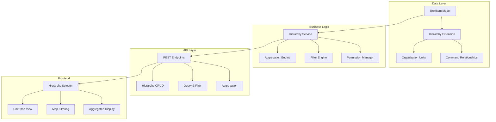

# Hierarchy of Forces - High-Level Design

## Executive Summary

This document provides a high-level design for implementing a military hierarchy of forces system in the GoATAK project. The system will support military organizational structures (squads → platoons → companies → battalions) with command relationships, data aggregation, filtering, and role-based visibility.

## 1. Current State Analysis

### 1.1 Existing Data Model
The current system has:
- **Item Model** ([`pkg/model/unit.go`](pkg/model/unit.go:25)): Core entity representing units, contacts, points, etc.
- **User Model** ([`internal/model/user.go`](internal/model/user.go:3)): Basic user with team, role, and scope
- **Parent Tracking**: Items already have `parent_uid` and `parent_callsign` fields (visible in [`UnitDetails.js`](front/static/js/components/UnitDetails.js:377-389))
- **Type Hierarchy**: Existing hierarchical type system for unit classification

### 1.2 Gaps for Military Hierarchy
- No formal organizational unit structure (squad, platoon, company, etc.)
- No command relationship modeling
- No hierarchical data aggregation
- No echelon-based filtering or visibility
- No dynamic attachment/detachment support
- Limited role-based access control

## 2. Design Overview

### 2.1 Core Principles
1. **Backward Compatibility**: Extend existing models without breaking current functionality
2. **Simplicity First**: Start with essential features, allow for future expansion
3. **Performance**: Efficient queries and minimal overhead
4. **Flexibility**: Support dynamic reorganization and attachments

### 2.2 Architecture Diagram



## 3. Data Model Design

### 3.1 Organization Unit Structure

```go
// New: Organization Unit (represents formal military units)
type OrganizationUnit struct {
    UID          string    `json:"uid"`           // Unique identifier
    Name         string    `json:"name"`          // Unit name (e.g., "Alpha Company")
    Callsign     string    `json:"callsign"`      // Radio callsign
    Echelon      string    `json:"echelon"`       // squad, platoon, company, battalion, brigade
    ParentUID    string    `json:"parent_uid"`    // Parent unit UID
    CommanderUID string    `json:"commander_uid"` // Commander's user/item UID
    UnitType     string    `json:"unit_type"`     // infantry, armor, artillery, etc.
    Status       string    `json:"status"`        // active, reserve, attached, detached
    Metadata     map[string]interface{} `json:"metadata"` // Flexible metadata
    CreatedAt    time.Time `json:"created_at"`
    UpdatedAt    time.Time `json:"updated_at"`
}
```

### 3.2 Extended Item Model

```go
// Extensions to existing Item struct in pkg/model/unit.go
type Item struct {
    // ... existing fields ...
    
    // New hierarchy fields
    orgUnitUID      string    // Organization unit this item belongs to
    echelon         string    // Direct echelon level (for quick filtering)
    commandLevel    int       // Numeric command level (0=lowest, higher=more senior)
    attachedTo      string    // Temporary attachment to different unit
    attachmentType  string    // operational, administrative, tactical
    visibilityScope []string  // List of org units that can see this item
}
```

### 3.3 Command Relationship

```go
// New: Command Relationship (tracks who commands whom)
type CommandRelationship struct {
    ID           string    `json:"id"`
    CommanderUID string    `json:"commander_uid"` // User or Item UID
    SubordinateUID string  `json:"subordinate_uid"` // Org Unit or Item UID
    RelationType string    `json:"relation_type"` // direct, operational, administrative
    StartTime    time.Time `json:"start_time"`
    EndTime      *time.Time `json:"end_time,omitempty"` // nil = active
}
```

### 3.4 Database Schema

```sql
-- Organization Units table
CREATE TABLE IF NOT EXISTS organization_units (
    uid TEXT PRIMARY KEY,
    name TEXT NOT NULL,
    callsign TEXT,
    echelon TEXT NOT NULL,
    parent_uid TEXT,
    commander_uid TEXT,
    unit_type TEXT,
    status TEXT DEFAULT 'active',
    metadata TEXT, -- JSON
    created_at TIMESTAMP DEFAULT CURRENT_TIMESTAMP,
    updated_at TIMESTAMP DEFAULT CURRENT_TIMESTAMP,
    FOREIGN KEY (parent_uid) REFERENCES organization_units(uid) ON DELETE SET NULL
);

-- Command Relationships table
CREATE TABLE IF NOT EXISTS command_relationships (
    id TEXT PRIMARY KEY,
    commander_uid TEXT NOT NULL,
    subordinate_uid TEXT NOT NULL,
    relation_type TEXT DEFAULT 'direct',
    start_time TIMESTAMP DEFAULT CURRENT_TIMESTAMP,
    end_time TIMESTAMP,
    UNIQUE(commander_uid, subordinate_uid, relation_type)
);

-- Item-to-OrgUnit mapping (extends existing items)
CREATE TABLE IF NOT EXISTS item_org_mapping (
    item_uid TEXT PRIMARY KEY,
    org_unit_uid TEXT NOT NULL,
    echelon TEXT,
    command_level INTEGER DEFAULT 0,
    attached_to TEXT,
    attachment_type TEXT,
    visibility_scope TEXT, -- JSON array
    FOREIGN KEY (org_unit_uid) REFERENCES organization_units(uid) ON DELETE CASCADE
);

-- Indexes for performance
CREATE INDEX IF NOT EXISTS idx_org_parent ON organization_units(parent_uid);
CREATE INDEX IF NOT EXISTS idx_org_echelon ON organization_units(echelon);
CREATE INDEX IF NOT EXISTS idx_cmd_commander ON command_relationships(commander_uid);
CREATE INDEX IF NOT EXISTS idx_cmd_subordinate ON command_relationships(subordinate_uid);
CREATE INDEX IF NOT EXISTS idx_item_org ON item_org_mapping(org_unit_uid);
```

## 4. API Design

### 4.1 Organization Unit Endpoints

```
# CRUD Operations
POST   /api/hierarchy/units              # Create organization unit
GET    /api/hierarchy/units              # List all units (with filters)
GET    /api/hierarchy/units/:uid         # Get specific unit
PUT    /api/hierarchy/units/:uid         # Update unit
DELETE /api/hierarchy/units/:uid         # Delete unit

# Hierarchy Queries
GET    /api/hierarchy/units/:uid/children    # Get direct children
GET    /api/hierarchy/units/:uid/descendants # Get all descendants
GET    /api/hierarchy/units/:uid/ancestors   # Get ancestor chain
GET    /api/hierarchy/units/:uid/tree        # Get full subtree

# Assignment Operations
POST   /api/hierarchy/units/:uid/assign      # Assign item to unit
POST   /api/hierarchy/units/:uid/attach      # Attach unit/item temporarily
DELETE /api/hierarchy/units/:uid/detach      # Detach unit/item
```

### 4.2 Filtering & Aggregation Endpoints

```
# Filtering
GET    /api/hierarchy/items?echelon=company          # Filter by echelon
GET    /api/hierarchy/items?org_unit=:uid            # Filter by org unit
GET    /api/hierarchy/items?command_level>=3         # Filter by command level

# Aggregation
GET    /api/hierarchy/aggregate/:uid                 # Get aggregated view
GET    /api/hierarchy/aggregate/:uid?level=platoon   # Aggregate to specific level
```

### 4.3 Request/Response Examples

**Create Organization Unit:**
```json
POST /api/hierarchy/units
{
  "name": "Alpha Company",
  "callsign": "Alpha-6",
  "echelon": "company",
  "parent_uid": "battalion-1-uid",
  "unit_type": "infantry",
  "commander_uid": "user-123"
}

Response: 201 Created
{
  "uid": "company-alpha-uid",
  "name": "Alpha Company",
  "callsign": "Alpha-6",
  "echelon": "company",
  "parent_uid": "battalion-1-uid",
  "commander_uid": "user-123",
  "unit_type": "infantry",
  "status": "active",
  "created_at": "2025-10-05T12:00:00Z"
}
```

**Get Unit Tree:**
```json
GET /api/hierarchy/units/battalion-1-uid/tree

Response: 200 OK
{
  "uid": "battalion-1-uid",
  "name": "1st Battalion",
  "echelon": "battalion",
  "children": [
    {
      "uid": "company-alpha-uid",
      "name": "Alpha Company",
      "echelon": "company",
      "children": [
        {
          "uid": "platoon-1-uid",
          "name": "1st Platoon",
          "echelon": "platoon",
          "children": []
        }
      ]
    }
  ]
}
```

## 5. Business Logic Design

### 5.1 Hierarchy Service

```go
// internal/hierarchy/service.go
type HierarchyService struct {
    db              *sql.DB
    itemsRepo       repository.ItemsRepository
    logger          *slog.Logger
    cache           *HierarchyCache
}

// Core operations
func (s *HierarchyService) CreateOrgUnit(unit *OrganizationUnit) error
func (s *HierarchyService) GetOrgUnit(uid string) (*OrganizationUnit, error)
func (s *HierarchyService) GetChildren(uid string) ([]*OrganizationUnit, error)
func (s *HierarchyService) GetAncestors(uid string) ([]*OrganizationUnit, error)
func (s *HierarchyService) AssignItemToUnit(itemUID, orgUnitUID string) error
func (s *HierarchyService) AttachUnit(unitUID, targetUID string, attachmentType string) error
func (s *HierarchyService) DetachUnit(unitUID string) error
```

### 5.2 Aggregation Engine

```go
// internal/hierarchy/aggregation.go
type AggregationEngine struct {
    hierarchyService *HierarchyService
    itemsRepo        repository.ItemsRepository
}

// Aggregate items by organizational unit
func (e *AggregationEngine) AggregateByUnit(orgUnitUID string, level string) (*AggregatedView, error)

type AggregatedView struct {
    OrgUnit      *OrganizationUnit
    ItemCount    int
    OnlineCount  int
    Position     *AggregatedPosition  // Center of mass or commander position
    SubUnits     []*AggregatedView
    Items        []*model.Item        // Only if at leaf level
}

type AggregatedPosition struct {
    Lat float64
    Lon float64
    Method string // "center_of_mass", "commander", "weighted_average"
}
```

### 5.3 Filter Engine

```go
// internal/hierarchy/filter.go
type FilterEngine struct {
    hierarchyService *HierarchyService
}

// Filter items based on hierarchy criteria
func (e *FilterEngine) FilterByEchelon(items []*model.Item, echelon string) []*model.Item
func (e *FilterEngine) FilterByOrgUnit(items []*model.Item, orgUnitUID string, includeChildren bool) []*model.Item
func (e *FilterEngine) FilterByCommandLevel(items []*model.Item, minLevel, maxLevel int) []*model.Item
func (e *FilterEngine) FilterByVisibility(items []*model.Item, userOrgUnitUID string) []*model.Item
```

### 5.4 Permission Manager

```go
// internal/hierarchy/permissions.go
type PermissionManager struct {
    hierarchyService *HierarchyService
}

// Check if user can see item based on hierarchy
func (m *PermissionManager) CanSeeItem(userUID string, itemUID string) bool
func (m *PermissionManager) CanCommandUnit(userUID string, orgUnitUID string) bool
func (m *PermissionManager) GetVisibleItems(userUID string, allItems []*model.Item) []*model.Item
```

## 6. Frontend Design

### 6.1 Component Architecture

```
components/
├── HierarchyTree.js          # Tree view of organization units
├── HierarchyFilter.js        # Filter controls for map
├── UnitAggregationView.js    # Aggregated unit display
├── CommandRelationship.js    # Show command relationships
└── AttachmentManager.js      # Manage attachments/detachments
```

### 6.2 Hierarchy Tree Component

```javascript
// front/static/js/components/HierarchyTree.js
Vue.component('HierarchyTree', {
  props: {
    rootUnitUID: String,
    selectedUID: String,
    expandedUIDs: Array
  },
  data() {
    return {
      treeData: null,
      loading: false
    }
  },
  methods: {
    async loadTree() {
      const response = await fetch(`/api/hierarchy/units/${this.rootUnitUID}/tree`)
      this.treeData = await response.json()
    },
    selectUnit(uid) {
      this.$emit('unit-selected', uid)
    },
    toggleExpand(uid) {
      this.$emit('toggle-expand', uid)
    }
  },
  template: `
    <div class="hierarchy-tree">
      <tree-node 
        v-if="treeData"
        :node="treeData"
        :selected-uid="selectedUID"
        :expanded-uids="expandedUIDs"
        @select="selectUnit"
        @toggle="toggleExpand"
      />
    </div>
  `
})
```

### 6.3 Map Integration

```javascript
// Extend existing map.js
class HierarchyMapController {
  constructor(map, hierarchyService) {
    this.map = map
    this.hierarchyService = hierarchyService
    this.currentFilter = null
    this.aggregationLevel = null
  }
  
  // Filter map items by organization unit
  filterByOrgUnit(orgUnitUID, includeChildren = true) {
    this.currentFilter = { type: 'org_unit', uid: orgUnitUID, includeChildren }
    this.refreshMap()
  }
  
  // Show aggregated view at specific echelon
  showAggregatedView(echelon) {
    this.aggregationLevel = echelon
    this.refreshMap()
  }
  
  // Display unit as single icon when zoomed out
  displayAsAggregated(orgUnit, items) {
    const position = this.calculateAggregatedPosition(items)
    const icon = this.createAggregatedIcon(orgUnit, items.length)
    // Add to map...
  }
}
```

### 6.4 Enhanced Unit Details

Extend existing [`UnitDetails.js`](front/static/js/components/UnitDetails.js:1) to show hierarchy information:

```javascript
// Add to UnitDetails component
computed: {
  hierarchyInfo() {
    return {
      orgUnit: this.item.org_unit_name,
      echelon: this.item.echelon,
      commander: this.item.commander_callsign,
      parentUnit: this.item.parent_unit_name,
      attachedTo: this.item.attached_to_name
    }
  }
}

// Add to template
<div v-if="hierarchyInfo.orgUnit" class="hierarchy-section">
  <h6>Hierarchy Information</h6>
  <dl>
    <dt>Organization Unit:</dt>
    <dd>{{ hierarchyInfo.orgUnit }} ({{ hierarchyInfo.echelon }})</dd>
    
    <dt v-if="hierarchyInfo.commander">Commander:</dt>
    <dd v-if="hierarchyInfo.commander">{{ hierarchyInfo.commander }}</dd>
    
    <dt v-if="hierarchyInfo.parentUnit">Parent Unit:</dt>
    <dd v-if="hierarchyInfo.parentUnit">{{ hierarchyInfo.parentUnit }}</dd>
    
    <dt v-if="hierarchyInfo.attachedTo">Attached To:</dt>
    <dd v-if="hierarchyInfo.attachedTo">
      {{ hierarchyInfo.attachedTo }}
      <button @click="detachUnit">Detach</button>
    </dd>
  </dl>
</div>
```

## 7. Implementation Phases

### Phase 1: Foundation (Week 1-2)
- [ ] Create database schema and migrations
- [ ] Implement basic OrganizationUnit model
- [ ] Create HierarchyService with CRUD operations
- [ ] Add basic API endpoints
- [ ] Unit tests for core functionality

### Phase 2: Integration (Week 3-4)
- [ ] Extend Item model with hierarchy fields
- [ ] Implement assignment and attachment logic
- [ ] Create aggregation engine
- [ ] Add hierarchy queries to existing endpoints
- [ ] Integration tests

### Phase 3: Frontend (Week 5-6)
- [ ] Create HierarchyTree component
- [ ] Implement hierarchy filtering in map
- [ ] Add hierarchy info to UnitDetails
- [ ] Create unit management UI
- [ ] E2E tests

### Phase 4: Advanced Features (Week 7-8)
- [ ] Implement permission system
- [ ] Add dynamic attachment/detachment
- [ ] Create aggregated map display
- [ ] Implement command relationship tracking
- [ ] Performance optimization

## 8. Key Design Decisions

### 8.1 Echelon Levels
Standard military echelons (extensible):
- `team` (4-5 personnel)
- `squad` (8-13 personnel)
- `platoon` (16-44 personnel)
- `company` (62-190 personnel)
- `battalion` (300-1000 personnel)
- `brigade` (3000-5000 personnel)
- `division` (10000-15000 personnel)

### 8.2 Aggregation Strategy
- **Zoom-based**: Automatically aggregate based on map zoom level
- **Manual**: User selects aggregation level
- **Position Calculation**: Use commander position or center of mass

### 8.3 Visibility Rules
1. Users see their own unit and all subordinates
2. Users see parent units (limited detail)
3. Users see peer units (configurable)
4. Commanders see all subordinate units
5. Special permissions can override defaults

### 8.4 Attachment Handling
- **Operational Attachment**: Temporary tactical control
- **Administrative Attachment**: For logistics/admin
- **Detachment**: Return to parent unit
- Track attachment history for reporting

## 9. Performance Considerations

### 9.1 Caching Strategy
```go
type HierarchyCache struct {
    orgUnits     *cache.Cache  // TTL: 5 minutes
    relationships *cache.Cache  // TTL: 5 minutes
    trees        *cache.Cache  // TTL: 10 minutes
}
```

### 9.2 Query Optimization
- Use recursive CTEs for tree queries
- Index on parent_uid, echelon, org_unit_uid
- Materialize frequently accessed paths
- Batch load related data

### 9.3 Frontend Optimization
- Lazy load tree nodes
- Virtual scrolling for large lists
- Debounce filter operations
- Cache aggregated views

## 10. Testing Strategy

### 10.1 Unit Tests
- OrganizationUnit CRUD operations
- Hierarchy traversal algorithms
- Aggregation calculations
- Permission checks

### 10.2 Integration Tests
- Item assignment to units
- Attachment/detachment workflows
- Filter and aggregation pipelines
- API endpoint responses

### 10.3 E2E Tests
- Create organization structure
- Assign items to units
- Filter map by hierarchy
- View aggregated display
- Attach/detach units

## 11. Migration Strategy

### 11.1 Data Migration
```sql
-- Migrate existing parent_uid relationships
INSERT INTO organization_units (uid, name, callsign, echelon, parent_uid)
SELECT DISTINCT 
    parent_uid,
    parent_callsign,
    parent_callsign,
    'unknown',
    NULL
FROM items 
WHERE parent_uid IS NOT NULL;

-- Map items to org units
INSERT INTO item_org_mapping (item_uid, org_unit_uid, echelon)
SELECT uid, parent_uid, 'unknown'
FROM items
WHERE parent_uid IS NOT NULL;
```

### 11.2 Backward Compatibility
- Keep existing parent_uid field
- Sync with org_unit_uid automatically
- Gradual migration of UI components
- Feature flags for new functionality

## 12. Future Enhancements

### 12.1 Advanced Features
- **Mission-based groupings**: Temporary task organizations
- **Cross-unit coordination**: Joint operations support
- **Historical tracking**: Unit movement and reorganization history
- **Reporting**: Generate unit status reports
- **Integration**: Connect with external C2 systems

### 12.2 Visualization Enhancements
- **3D hierarchy view**: Interactive org chart
- **Timeline view**: Show unit evolution over time
- **Heat maps**: Unit density and activity
- **Network graphs**: Command relationships

## 13. Security Considerations

### 13.1 Access Control
- Validate user permissions on all hierarchy operations
- Encrypt sensitive unit information
- Audit log for hierarchy changes
- Rate limiting on hierarchy queries

### 13.2 Data Protection
- Sanitize user inputs
- Prevent SQL injection in dynamic queries
- Validate hierarchy relationships (no cycles)
- Secure attachment/detachment operations

## 14. Monitoring & Metrics

### 14.1 Key Metrics
- Hierarchy depth (max levels)
- Units per echelon
- Items per unit (distribution)
- Attachment frequency
- Query performance (p95, p99)

### 14.2 Alerts
- Orphaned items (no org unit)
- Circular references in hierarchy
- Performance degradation
- Failed attachment operations

## 15. Documentation Requirements

### 15.1 User Documentation
- How to create organization units
- How to assign items to units
- How to use hierarchy filtering
- How to attach/detach units

### 15.2 Developer Documentation
- API reference
- Data model documentation
- Integration guide
- Testing guide

## Conclusion

This design provides a comprehensive, scalable solution for implementing military hierarchy of forces in GoATAK. The phased approach allows for incremental development and testing, while the modular architecture ensures maintainability and extensibility.

The design leverages existing infrastructure (Item model, database, API patterns) while adding new capabilities for organizational structure, command relationships, and hierarchical data management. The result will be a system that supports military operational requirements while maintaining simplicity and performance.