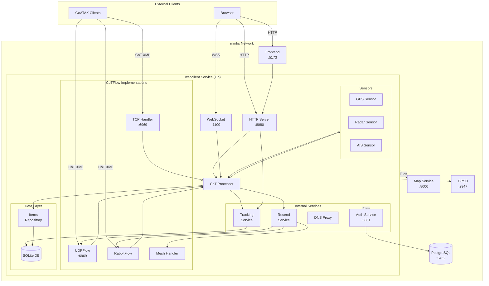
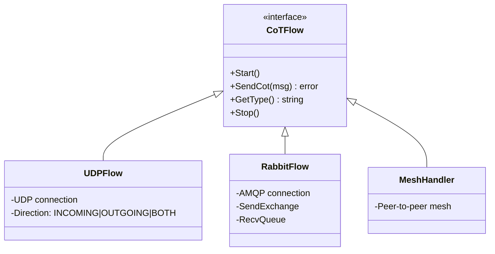
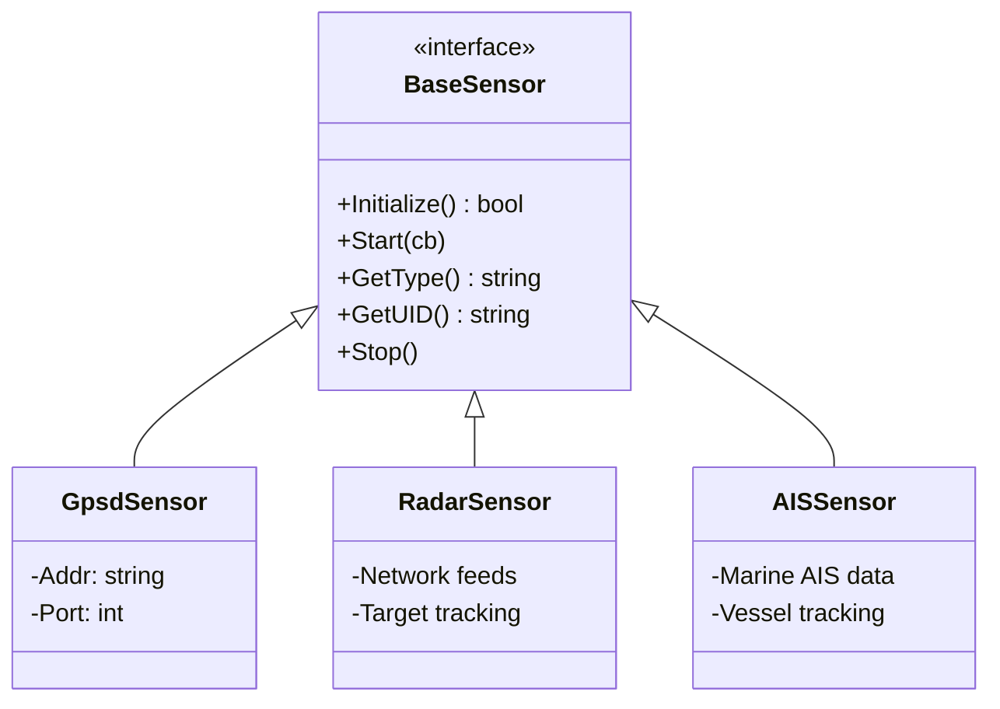
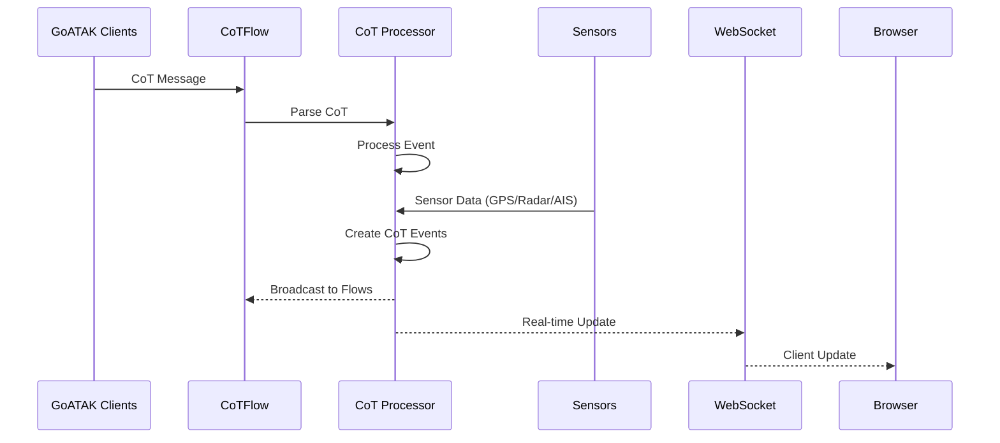

# GOATAK Architecture

## System Overview

## CoTFlow Interface

The `CoTFlow` interface handles CoT message transmission/reception:

## Sensors

The system supports various sensors that generate CoT events:

## Services

| Service          | Image           | Ports            | Purpose         |
| ---------------- | --------------- | ---------------- | --------------- |
| **webclient**    | goatak-client   | 8080, 6969, 1100 | Main CoT server |
| **frontend**     | goatak-frontend | 5173             | Web UI          |
| **map**          | goatak-maps     | 8000             | Map tiles       |
| **auth-service** | goatak-auth     | 8081             | Authentication  |
| **postgres**     | postgres:15     | 5432             | Auth database   |
| **gpsd**         | docker-gpsd     | 2947, 5577       | GPS daemon      |

## Data Flow

## Tech Stack

- **Backend**: Go
- **Frontend**: Vue.js 3 + Leaflet
- **Database**: PostgreSQL, SQLite
- **Protocol**: CoT (Cursor on Target)
- **Sensors**: GPSD, Radar, AIS
