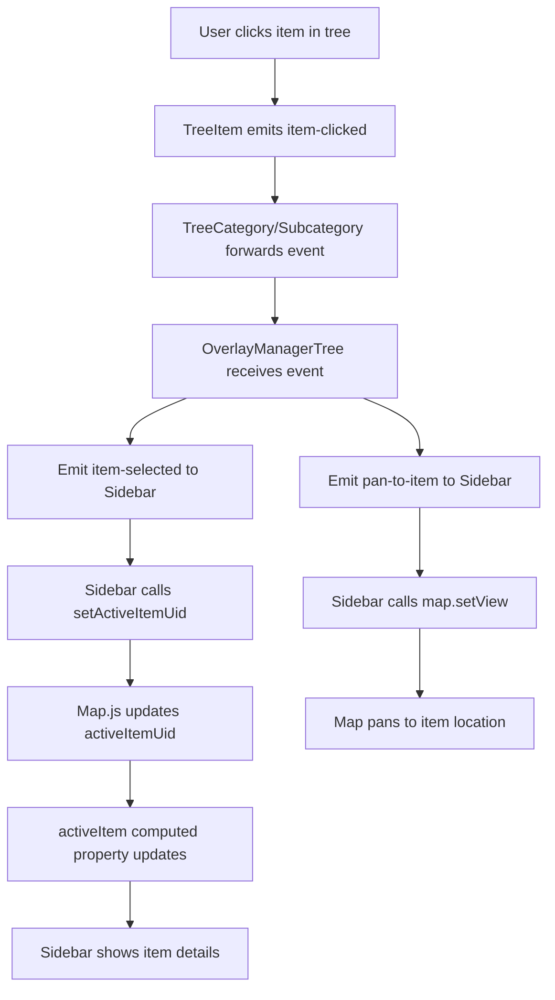
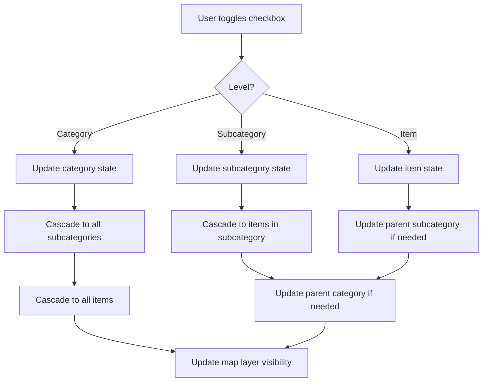

# Improved Overlay Manager - Comprehensive Design Document

## 1. Executive Summary

This document provides a complete architectural design for an improved overlay manager component with tree view structure for the GoATAK tactical mapping application. The new component will replace the current flat list with a hierarchical tree structure that allows category-level, subcategory-level, and individual item visibility control and selection.

---

## 2. Current Implementation Analysis

### 2.1 Existing Structure

- **Location**: [`staticfiles/static/js/components/overlays.js`](../staticfiles/static/js/components/overlays.js)
- **Component**: `OverlaysList` Vue component
- **Data Format**: Flat object with 6 categories (contact, unit, alarm, point, drawing, route)
- **Features**:
  - Boolean active state per category
  - Item count display per category
  - Checkbox toggles for category visibility
  - Persian (RTL) labels
  - Integration with map layers via `toggleOverlay` prop

### 2.2 Item Data Structure

Items are stored in `sharedState.items` Map with the following key properties:

```javascript
{
  uid: "unique-identifier",
  category: "contact|unit|alarm|point|drawing|route|report",
  type: "CoT-type-string",          // e.g., "a-f-G", "b-a-o-tbl"
  callsign: "Display Name",
  lat: 35.6892,
  lon: 51.3890,
  aff: "f|h|n|u",                   // Affiliation (friendly, hostile, neutral, unknown)
  // ... other properties
}
```

**Affiliation Extraction**: For units, affiliation is extracted from `item.type` at character position 2:

- `a-f-*` → Friendly (f)
- `a-h-*` → Hostile (h)
- `a-n-*` → Neutral (n)
- `a-u-*` → Unknown (u)

### 2.3 Current Limitations

- No subcategorization
- No individual item visibility control
- No direct item selection from overlay list
- No pan-to-item functionality
- Cannot distinguish between different unit types or alarm types

---

## 3. Component Architecture Design

### 3.1 Component Hierarchy

```
OverlayManagerTree (Root Component)
├── TreeCategory (Reusable Component for Categories)
│   ├── TreeSubcategory (Reusable Component for Subcategories)
│   │   └── TreeItem (Reusable Component for Individual Items)
│   └── TreeItem (For categories without subcategories)
└── [Repeat for each category]
```

### 3.2 Single Component vs Multi-Component Approach

**Recommended: Multi-Component Architecture**

**Rationale:**

1. **Reusability**: TreeCategory, TreeSubcategory, and TreeItem components can handle any level
2. **Maintainability**: Isolated concerns make debugging easier
3. **Scalability**: Easy to add new categories or levels
4. **Performance**: Vue can optimize re-renders at component boundaries

**Component Responsibilities:**

#### 3.2.1 `OverlayManagerTree` (Root Component)

- Owns the tree data structure
- Manages global visibility state
- Computes item counts per category/subcategory
- Handles event delegation (item clicks, checkbox changes)
- Emits events to parent (activeItem changes, map pan requests)

**Props:**

```javascript
{
  toggleOverlay: Function,  // Inherited from current implementation
  map: Object,             // Leaflet map instance
  activeItemUid: String    // Currently selected item UID
}
```

**Data:**

```javascript
{
  sharedState: store.state,
  treeData: Array,         // Computed tree structure
  visibilityState: Object, // Tracks checked state at all levels
  expandedCategories: Set, // Which categories are expanded
  expandedSubcategories: Set // Which subcategories are expanded
}
```

**Emitted Events:**

```javascript
{
  'item-selected': { uid, item },
  'pan-to-item': { lat, lon }
}
```

#### 3.2.2 `TreeCategory` Component

- Renders category header with checkbox and expand/collapse icon
- Shows item count badge
- Manages expanded state for category
- Renders child subcategories or items

**Props:**

```javascript
{
  category: Object,        // { name, title, items, subcategories, visible }
  isExpanded: Boolean,
  activeItemUid: String
}
```

**Emitted Events:**

```javascript
{
  'toggle-visibility': { categoryName, newState },
  'toggle-expand': { categoryName },
  'item-clicked': { uid, item }
}
```

#### 3.2.3 `TreeSubcategory` Component

- Renders subcategory header with checkbox and expand/collapse icon
- Shows item count badge
- Manages subcategory visibility

**Props:**

```javascript
{
  subcategory: Object,     // { name, title, items, visible }
  categoryName: String,
  isExpanded: Boolean,
  activeItemUid: String
}
```

**Emitted Events:**

```javascript
{
  'toggle-visibility': { categoryName, subcategoryName, newState },
  'toggle-expand': { categoryName, subcategoryName },
  'item-clicked': { uid, item }
}
```

#### 3.2.4 `TreeItem` Component

- Renders individual item with checkbox
- Shows callsign
- Indicates if item is active/selected
- Handles click to select

**Props:**

```javascript
{
  item: Object,           // Full item object
  isActive: Boolean,      // Is this the activeItem?
  visible: Boolean        // Visibility state
}
```

**Emitted Events:**

```javascript
{
  'toggle-visibility': { uid, newState },
  'item-clicked': { uid, item }
}
```

---

## 4. Data Structure Design

### 4.1 Tree Data Structure

The tree is computed from `sharedState.items` using a computed property:

```javascript
// Computed property in OverlayManagerTree
computed: {
  treeData() {
    return [
      {
        name: 'contact',
        title: 'مخاطبین',
        type: 'category',
        hasSubcategories: false,
        items: this.getContactItems(),
        itemCount: this.countItems('contact'),
        visible: this.visibilityState.contact
      },
      {
        name: 'unit',
        title: 'نیروها',
        type: 'category',
        hasSubcategories: true,
        subcategories: [
          {
            name: 'friendly',
            title: 'دوست',
            items: this.getUnitsByAff('f'),
            itemCount: this.countUnitsByAff('f'),
            visible: this.visibilityState.unit.friendly
          },
          {
            name: 'hostile',
            title: 'دشمن',
            items: this.getUnitsByAff('h'),
            itemCount: this.countUnitsByAff('h'),
            visible: this.visibilityState.unit.hostile
          },
          {
            name: 'neutral',
            title: 'بی‌طرف',
            items: this.getUnitsByAff('n'),
            itemCount: this.countUnitsByAff('n'),
            visible: this.visibilityState.unit.neutral
          },
          {
            name: 'unknown',
            title: 'نامشخص',
            items: this.getUnitsByAff('u'),
            itemCount: this.countUnitsByAff('u'),
            visible: this.visibilityState.unit.unknown
          }
        ],
        itemCount: this.countItems('unit'),
        visible: this.visibilityState.unit.all
      },
      {
        name: 'alarm',
        title: 'هشدارها',
        type: 'category',
        hasSubcategories: true,
        subcategories: [
          {
            name: 'emergency',
            title: 'اضطراری',
            items: this.getAlarmsByType('b-a-o-tbl'),
            itemCount: this.countAlarmsByType('b-a-o-tbl'),
            visible: this.visibilityState.alarm.emergency
          },
          {
            name: 'general',
            title: 'عمومی',
            items: this.getAlarmsByType('b-a-g'),
            itemCount: this.countAlarmsByType('b-a-g'),
            visible: this.visibilityState.alarm.general
          },
          {
            name: 'other',
            title: 'سایر',
            items: this.getAlarmsOtherTypes(),
            itemCount: this.countAlarmsOtherTypes(),
            visible: this.visibilityState.alarm.other
          }
        ],
        itemCount: this.countItems('alarm'),
        visible: this.visibilityState.alarm.all
      },
      {
        name: 'point',
        title: 'نقاط',
        type: 'category',
        hasSubcategories: false,
        items: this.getPointItems(),
        itemCount: this.countItems('point'),
        visible: this.visibilityState.point
      },
      {
        name: 'drawing',
        title: 'ناحیه‌ها',
        type: 'category',
        hasSubcategories: false,
        items: this.getDrawingItems(),
        itemCount: this.countItems('drawing'),
        visible: this.visibilityState.drawing
      },
      {
        name: 'route',
        title: 'مسیرها',
        type: 'category',
        hasSubcategories: false,
        items: this.getRouteItems(),
        itemCount: this.countItems('route'),
        visible: this.visibilityState.route
      }
    ];
  }
}
```

### 4.2 Visibility State Structure

```javascript
data() {
  return {
    visibilityState: {
      contact: true,
      unit: {
        all: true,          // Category-level state
        friendly: true,
        hostile: true,
        neutral: true,
        unknown: true,
        items: {}          // { uid: true/false }
      },
      alarm: {
        all: true,
        emergency: true,
        general: true,
        other: true,
        items: {}
      },
      point: {
        all: true,
        items: {}
      },
      drawing: {
        all: true,
        items: {}
      },
      route: {
        all: true,
        items: {}
      }
    }
  }
}
```

### 4.3 Expand/Collapse State

```javascript
data() {
  return {
    expandedCategories: new Set(['unit', 'alarm']), // Default expanded
    expandedSubcategories: new Map([
      ['unit', new Set(['friendly'])],
      ['alarm', new Set()]
    ])
  }
}
```

---

## 5. Visibility State Management Algorithm

### 5.1 Cascading Checkbox Logic

#### Rule 1: Parent Unchecked → All Children Unchecked

When a category/subcategory is unchecked, all its children (subcategories and items) are unchecked.

```javascript
methods: {
  toggleCategoryVisibility(categoryName, newState) {
    if (this.categoryHasSubcategories(categoryName)) {
      // Update category state
      this.visibilityState[categoryName].all = newState;

      // Cascade to subcategories
      this.treeData.find(c => c.name === categoryName)
        .subcategories.forEach(sub => {
          this.visibilityState[categoryName][sub.name] = newState;

          // Cascade to items in subcategory
          sub.items.forEach(item => {
            this.visibilityState[categoryName].items[item.uid] = newState;
            this.updateItemVisibility(item, newState);
          });
        });
    } else {
      // Simple category, toggle all items
      this.visibilityState[categoryName].all = newState;
      this.getItemsByCategory(categoryName).forEach(item => {
        this.visibilityState[categoryName].items[item.uid] = newState;
        this.updateItemVisibility(item, newState);
      });
    }

    // Update map overlay visibility
    this.toggleOverlay(categoryName, newState);
  }
}
```

#### Rule 2: All Children Checked → Parent Checked

When all children of a category/subcategory are checked, the parent is automatically checked.

```javascript
methods: {
  toggleSubcategoryVisibility(categoryName, subcategoryName, newState) {
    // Update subcategory state
    this.visibilityState[categoryName][subcategoryName] = newState;

    // Cascade to items
    const subcategory = this.getSubcategory(categoryName, subcategoryName);
    subcategory.items.forEach(item => {
      this.visibilityState[categoryName].items[item.uid] = newState;
      this.updateItemVisibility(item, newState);
    });

    // Check if all subcategories are now checked → update category
    this.updateParentCategoryState(categoryName);
  },

  toggleItemVisibility(categoryName, subcategoryName, uid, newState) {
    // Update item state
    this.visibilityState[categoryName].items[uid] = newState;
    const item = this.sharedState.items.get(uid);
    this.updateItemVisibility(item, newState);

    // Update subcategory state if all items checked
    if (subcategoryName) {
      this.updateSubcategoryState(categoryName, subcategoryName);
    }

    // Update category state
    this.updateParentCategoryState(categoryName);
  },

  updateSubcategoryState(categoryName, subcategoryName) {
    const subcategory = this.getSubcategory(categoryName, subcategoryName);
    const allItemsChecked = subcategory.items.every(item =>
      this.visibilityState[categoryName].items[item.uid]
    );
    this.visibilityState[categoryName][subcategoryName] = allItemsChecked;
  },

  updateParentCategoryState(categoryName) {
    const category = this.treeData.find(c => c.name === categoryName);

    if (category.hasSubcategories) {
      const allSubcategoriesChecked = category.subcategories.every(sub =>
        this.visibilityState[categoryName][sub.name]
      );
      this.visibilityState[categoryName].all = allSubcategoriesChecked;
    } else {
      const allItemsChecked = category.items.every(item =>
        this.visibilityState[categoryName].items[item.uid]
      );
      this.visibilityState[categoryName].all = allItemsChecked;
    }
  }
}
```

#### Rule 3: Indeterminate State

Checkboxes show indeterminate state when some (but not all) children are checked.

```javascript
computed: {
  getCategoryCheckboxState(categoryName) {
    const state = this.visibilityState[categoryName];

    if (state.all) {
      return 'checked';
    }

    // Check if any subcategory or item is checked
    const category = this.treeData.find(c => c.name === categoryName);
    if (category.hasSubcategories) {
      const anySubcategoryChecked = category.subcategories.some(sub =>
        state[sub.name]
      );
      return anySubcategoryChecked ? 'indeterminate' : 'unchecked';
    } else {
      const anyItemChecked = Object.values(state.items).some(v => v);
      return anyItemChecked ? 'indeterminate' : 'unchecked';
    }
  }
}
```

### 5.2 Integration with Map Layer Visibility

```javascript
methods: {
  updateItemVisibility(item, visible) {
    if (!item || !item.marker) return;

    const overlay = this.getItemOverlay(item);
    if (visible) {
      if (!overlay.hasLayer(item.marker)) {
        overlay.addLayer(item.marker);
      }
      if (item.infoMarker && !overlay.hasLayer(item.infoMarker)) {
        overlay.addLayer(item.infoMarker);
      }
      if (item.textLabel && !overlay.hasLayer(item.textLabel)) {
        overlay.addLayer(item.textLabel);
      }
    } else {
      if (overlay.hasLayer(item.marker)) {
        overlay.removeLayer(item.marker);
      }
      if (item.infoMarker && overlay.hasLayer(item.infoMarker)) {
        overlay.removeLayer(item.infoMarker);
      }
      if (item.textLabel && overlay.hasLayer(item.textLabel)) {
        overlay.removeLayer(item.textLabel);
      }
    }
  },

  getItemOverlay(item) {
    // Access map overlays from parent app
    return this.$parent.overlays[item.category];
  }
}
```

---

## 6. Affiliation and Alarm Type Mappings

### 6.1 Unit Affiliation Mapping

```javascript
const AFFILIATION_MAP = {
  f: {
    code: "f",
    name: "friendly",
    title: "دوست",
    color: "#00FFFF", // Cyan for friendly
    icon: "bi-person-check",
  },
  h: {
    code: "h",
    name: "hostile",
    title: "دشمن",
    color: "#FF0000", // Red for hostile
    icon: "bi-person-x",
  },
  n: {
    code: "n",
    name: "neutral",
    title: "بی‌طرف",
    color: "#00FF00", // Green for neutral
    icon: "bi-person-dash",
  },
  u: {
    code: "u",
    name: "unknown",
    title: "نامشخص",
    color: "#FFFF00", // Yellow for unknown
    icon: "bi-person-question",
  },
};

// Extract affiliation from CoT type
function getAffiliationFromType(type) {
  if (!type || type.length < 3) return "u";
  const affCode = type.charAt(2);
  return AFFILIATION_MAP[affCode] ? affCode : "u";
}

// Get affiliation info
function getAffiliationInfo(affCode) {
  return AFFILIATION_MAP[affCode] || AFFILIATION_MAP["u"];
}
```

### 6.2 Alarm Type Mapping

```javascript
const ALARM_TYPE_MAP = {
  "b-a-o-tbl": {
    code: "b-a-o-tbl",
    name: "emergency",
    title: "اضطراری",
    icon: "bi-exclamation-triangle-fill",
    color: "#FF0000",
  },
  "b-a-o-can": {
    code: "b-a-o-can",
    name: "cancel",
    title: "لغو",
    icon: "bi-x-circle",
    color: "#808080",
  },
  "b-a-o-pan": {
    code: "b-a-o-pan",
    name: "panic",
    title: "وحشت",
    icon: "bi-exclamation-octagon-fill",
    color: "#FF6600",
  },
  "b-a-o-opn": {
    code: "b-a-o-opn",
    name: "ops",
    title: "عملیاتی",
    icon: "bi-info-circle-fill",
    color: "#0066FF",
  },
  "b-a-g": {
    code: "b-a-g",
    name: "general",
    title: "عمومی",
    icon: "bi-bell-fill",
    color: "#FFA500",
  },
};

// Get alarm type info
function getAlarmTypeInfo(type) {
  return (
    ALARM_TYPE_MAP[type] || {
      code: type,
      name: "other",
      title: "سایر",
      icon: "bi-bell",
      color: "#808080",
    }
  );
}

// Group alarms by type
function groupAlarmsByType() {
  const grouped = {
    "b-a-o-tbl": [],
    "b-a-g": [],
    other: [],
  };

  this.sharedState.items.forEach((item) => {
    if (item.category !== "alarm" || item.uid.endsWith("-fence")) return;

    if (item.type === "b-a-o-tbl") {
      grouped["b-a-o-tbl"].push(item);
    } else if (item.type === "b-a-g") {
      grouped["b-a-g"].push(item);
    } else if (!item.type.endsWith("-can")) {
      grouped["other"].push(item);
    }
  });

  return grouped;
}
```

---

## 7. UI/UX Design

### 7.1 Visual Wireframe

```
┌──────────────────────────────────────────────┐
│ لایه‌ها                      [Card Header]   │
├──────────────────────────────────────────────┤
│                                              │
│ ☑ مخاطبین [12] ────────────────────────────│
│   ├ Contact-1  [○]                          │
│   ├ Contact-2  [●] ← Active                 │
│   └ Contact-3  [○]                          │
│                                              │
│ ☑ نیروها [45] ─────────────────────────────│
│   ▼ ☑ دοست [20]                            │
│     ├ Unit-A   [○]                          │
│     └ Unit-B   [○]                          │
│   ▶ ☑ دشمن [15]                             │
│   ▶ ☐ بی‌طرف [8]                            │
│   ▶ ☑ نامشخص [2]                            │
│                                              │
│ ☑ هشدارها [3] ─────────────────────────────│
│   ▼ ☑ اضطراری [2]                           │
│     └ Emergency-Alert [○]                   │
│   ▶ ☐ عمومی [0]                             │
│   ▶ ☑ سایر [1]                              │
│                                              │
│ ☑ نقاط [8] ────────────────────────────────│
│   ├ Point-1   [○]                           │
│   └ Point-2   [○]                           │
│                                              │
│ ☑ ناحیه‌ها [5] ────────────────────────────│
│   └ Zone-Alpha [○]                          │
│                                              │
│ ☑ مسیرها [3] ──────────────────────────────│
│   └ Route-1    [○]                          │
│                                              │
└──────────────────────────────────────────────┘

Legend:
☑ = Checked checkbox
☐ = Unchecked checkbox
☒ = Indeterminate checkbox
▼ = Expanded
▶ = Collapsed
[12] = Item count badge
[○] = Visibility checkbox (unchecked)
[●] = Visibility checkbox (checked) + Active
```

### 7.2 Component Template Structure

```vue
<template>
  <div class="card overlay-manager-tree">
    <h5 class="card-header">لایه‌ها</h5>
    <div class="card-body p-0">
      <div class="tree-container">
        <tree-category
          v-for="category in treeData"
          :key="category.name"
          :category="category"
          :is-expanded="expandedCategories.has(category.name)"
          :active-item-uid="activeItemUid"
          @toggle-visibility="handleCategoryToggle"
          @toggle-expand="handleCategoryExpand"
          @item-clicked="handleItemClick"
        />
      </div>
    </div>
  </div>
</template>
```

### 7.3 TreeCategory Template

```vue
<template>
  <div class="tree-category" :class="{ expanded: isExpanded }">
    <!-- Category Header -->
    <div class="tree-node category-header">
      <div class="node-content">
        <!-- Expand/Collapse Icon (if has subcategories) -->
        <i
          v-if="category.hasSubcategories"
          class="expand-icon bi"
          :class="isExpanded ? 'bi-chevron-down' : 'bi-chevron-left'"
          @click="$emit('toggle-expand', category.name)"
        ></i>

        <!-- Checkbox -->
        <input
          type="checkbox"
          class="form-check-input me-2"
          :checked="category.visible"
          :indeterminate.prop="checkboxState === 'indeterminate'"
          @change="
            $emit('toggle-visibility', category.name, $event.target.checked)
          "
        />

        <!-- Category Title -->
        <label class="category-title">{{ category.title }}</label>

        <!-- Item Count Badge -->
        <span class="badge bg-success rounded-pill ms-auto">
          {{ category.itemCount }}
        </span>
      </div>
    </div>

    <!-- Subcategories or Items -->
    <transition name="slide-fade">
      <div v-show="isExpanded" class="tree-children">
        <!-- Subcategories -->
        <tree-subcategory
          v-if="category.hasSubcategories"
          v-for="subcategory in category.subcategories"
          :key="subcategory.name"
          :subcategory="subcategory"
          :category-name="category.name"
          :is-expanded="isSubcategoryExpanded(category.name, subcategory.name)"
          :active-item-uid="activeItemUid"
          @toggle-visibility="handleSubcategoryToggle"
          @toggle-expand="handleSubcategoryExpand"
          @item-clicked="$emit('item-clicked', $event)"
        />

        <!-- Direct Items (no subcategories) -->
        <tree-item
          v-else
          v-for="item in category.items"
          :key="item.uid"
          :item="item"
          :is-active="item.uid === activeItemUid"
          :visible="getItemVisibility(category.name, item.uid)"
          @toggle-visibility="handleItemToggle"
          @item-clicked="$emit('item-clicked', $event)"
        />
      </div>
    </transition>
  </div>
</template>
```

### 7.4 TreeItem Template

```vue
<template>
  <div
    class="tree-item"
    :class="{
      active: isActive,
      'item-hidden': !visible,
    }"
    @click="handleItemClick"
  >
    <div class="node-content">
      <!-- Visibility Checkbox -->
      <input
        type="checkbox"
        class="form-check-input me-2"
        :checked="visible"
        @change.stop="
          $emit('toggle-visibility', item.uid, $event.target.checked)
        "
      />

      <!-- Item Icon (optional) -->
      <i v-if="itemIcon" :class="itemIcon" class="item-icon me-1"></i>

      <!-- Item Callsign -->
      <span class="item-callsign">{{ item.callsign }}</span>

      <!-- Pan to Item Button -->
      <button
        class="btn btn-sm btn-link ms-auto p-0"
        @click.stop="handlePanClick"
        title="پرش به موقعیت"
      >
        <i class="bi bi-geo-alt"></i>
      </button>
    </div>
  </div>
</template>
```

### 7.5 CSS Styling

```css
/* Tree Container */
.overlay-manager-tree .tree-container {
  max-height: 600px;
  overflow-y: auto;
  padding: 0.5rem;
}

/* Tree Nodes */
.tree-node {
  padding: 0.5rem;
  border-radius: 4px;
  cursor: pointer;
  transition: background-color 0.2s;
}

.tree-node:hover {
  background-color: rgba(0, 0, 0, 0.05);
}

.node-content {
  display: flex;
  align-items: center;
  gap: 0.5rem;
}

/* Category Header */
.category-header {
  font-weight: 600;
  margin-bottom: 0.25rem;
}

.category-title {
  flex: 1;
  cursor: pointer;
  margin: 0;
}

/* Expand Icon */
.expand-icon {
  cursor: pointer;
  width: 1rem;
  transition: transform 0.2s;
}

/* Tree Children */
.tree-children {
  padding-right: 1.5rem;
  border-right: 2px solid rgba(0, 0, 0, 0.1);
  margin-right: 0.5rem;
}

/* Subcategory */
.tree-subcategory {
  margin-top: 0.25rem;
}

.subcategory-header {
  font-weight: 500;
  font-size: 0.95rem;
}

/* Item */
.tree-item {
  padding: 0.25rem 0.5rem;
  border-radius: 3px;
  font-size: 0.9rem;
}

.tree-item.active {
  background-color: rgba(13, 110, 253, 0.1);
  border-right: 3px solid #0d6efd;
}

.tree-item.item-hidden {
  opacity: 0.5;
}

.item-callsign {
  flex: 1;
}

.item-icon {
  color: #6c757d;
}

/* Animations */
.slide-fade-enter-active {
  transition: all 0.3s ease;
}

.slide-fade-leave-active {
  transition: all 0.2s cubic-bezier(1, 0.5, 0.8, 1);
}

.slide-fade-enter-from,
.slide-fade-leave-to {
  transform: translateX(10px);
  opacity: 0;
}

/* RTL Support */
[dir="rtl"] .tree-children {
  padding-right: 0;
  padding-left: 1.5rem;
  border-right: none;
  border-left: 2px solid rgba(0, 0, 0, 0.1);
  margin-right: 0;
  margin-left: 0.5rem;
}

[dir="rtl"] .tree-item.active {
  border-right: none;
  border-left: 3px solid #0d6efd;
}

/* Badge */
.badge {
  font-size: 0.75rem;
  min-width: 1.5rem;
}

/* Checkbox Indeterminate State */
input[type="checkbox"]:indeterminate {
  background-color: #0d6efd;
  border-color: #0d6efd;
}

input[type="checkbox"]:indeterminate::after {
  content: "−";
  display: block;
  text-align: center;
  color: white;
  font-weight: bold;
}
```

---

## 8. Integration Points

### 8.1 Parent Component Integration (`Sidebar.js`)

**Current Integration:**

```vue
<overlays-list :toggle-overlay="toggleOverlay"></overlays-list>
```

**New Integration:**

```vue
<overlay-manager-tree
  :toggle-overlay="toggleOverlay"
  :map="map"
  :active-item-uid="activeItem ? activeItem.uid : null"
  @item-selected="handleOverlayItemSelected"
  @pan-to-item="handlePanToItem"
></overlay-manager-tree>
```

**New Methods in Sidebar:**

```javascript
methods: {
  handleOverlayItemSelected(event) {
    // Set the selected item as active
    this.$emit('set-active-item', event.uid);
  },

  handlePanToItem(event) {
    // Pan map to item location
    if (this.map && event.lat && event.lon) {
      this.map.setView([event.lat, event.lon]);
    }
  }
}
```

### 8.2 Map.js Integration

**Connect activeItemUid:**

```javascript
// In map.js, ensure activeItemUid is passed to sidebar
template: `
  <sidebar
    ...
    :active-item="activeItem"
    @set-active-item="setActiveItemUid"
  ></sidebar>
`;
```

**Item Selection Handler:**

```javascript
methods: {
  handleOverlayItemClick(uid) {
    this.setActiveItemUid(uid, true); // true = pan to item
  }
}
```

### 8.3 Store Integration

No changes required to [`store.js`](../staticfiles/static/js/store.js). The component reads from `sharedState.items` directly.

### 8.4 Backward Compatibility

The `toggleOverlay` function remains the same, ensuring compatibility with existing map layer toggle logic:

```javascript
// In map.js
toggleOverlay: function (overlayName, overlayActive) {
  console.log("toggleOverlay", overlayName, overlayActive);
  if (!overlayActive) this.overlays[overlayName].removeFrom(this.map);
  else this.overlays[overlayName].addTo(this.map);
}
```

---

## 9. Performance Considerations

### 9.1 Computed Properties

Use computed properties for expensive operations:

```javascript
computed: {
  // Cache tree data structure
  treeData() { /* ... */ },

  // Cache filtered items
  contactItems() {
    return Array.from(this.sharedState.items.values())
      .filter(item => item.category === 'contact' && !item.uid.endsWith('-fence'))
      .sort((a, b) => a.callsign.localeCompare(b.callsign, 'fa'));
  },

  unitsByAffiliation() {
    const units = {};
    ['f', 'h', 'n', 'u'].forEach(aff => {
      units[aff] = Array.from(this.sharedState.items.values())
        .filter(item =>
          item.category === 'unit' &&
          !item.uid.endsWith('-fence') &&
          this.getAffiliationFromType(item.type) === aff
        )
        .sort((a, b) => a.callsign.localeCompare(b.callsign, 'fa'));
    });
    return units;
  }
}
```

### 9.2 Virtual Scrolling (Future Enhancement)

For large datasets (>1000 items), consider implementing virtual scrolling:

```javascript
// Use vue-virtual-scroller library
<recycle-scroller
  class="tree-scroller"
  :items="flattenedTreeItems"
  :item-size="32"
  key-field="uid"
>
  <template #default="{ item }">
    <tree-item :item="item" />
  </template>
</recycle-scroller>
```

### 9.3 Debouncing State Updates

Debounce rapid checkbox toggles to prevent excessive re-renders:

```javascript
methods: {
  toggleVisibilityDebounced: _.debounce(function (categoryName, state) {
    this.toggleCategoryVisibility(categoryName, state);
  }, 100);
}
```

### 9.4 Lazy Loading Subcategories

Only compute subcategory items when expanded:

```javascript
computed: {
  activeSubcategoryItems() {
    const items = {};
    this.expandedSubcategories.forEach((categoryName, subcategoryNames) => {
      subcategoryNames.forEach(subName => {
        const key = `${categoryName}.${subName}`;
        items[key] = this.getSubcategoryItems(categoryName, subName);
      });
    });
    return items;
  }
}
```

---

## 10. Implementation Pseudocode

### 10.1 Main Component Logic

```javascript
Vue.component("OverlayManagerTree", {
  data() {
    return {
      sharedState: store.state,
      visibilityState: this.initializeVisibilityState(),
      expandedCategories: new Set(["unit", "alarm"]),
      expandedSubcategories: new Map(),
    };
  },

  computed: {
    treeData() {
      return this.buildTreeStructure();
    },
  },

  watch: {
    "sharedState.ts"() {
      // React to item changes
      this.updateVisibilityStates();
    },
  },

  methods: {
    // Build tree structure from items
    buildTreeStructure() {
      /* See Section 4.1 */
    },

    // Initialize visibility state
    initializeVisibilityState() {
      /* See Section 4.2 */
    },

    // Handle category checkbox toggle
    handleCategoryToggle(categoryName, newState) {
      /* See Section 5.1 */
    },

    // Handle subcategory checkbox toggle
    handleSubcategoryToggle(categoryName, subcategoryName, newState) {
      /* See Section 5.1 */
    },

    // Handle item checkbox toggle
    handleItemToggle(categoryName, subcategoryName, uid, newState) {
      /* See Section 5.1 */
    },

    // Handle item click for selection
    handleItemClick(uid) {
      this.$emit("item-selected", {
        uid,
        item: this.sharedState.items.get(uid),
      });

      const item = this.sharedState.items.get(uid);
      this.$emit("pan-to-item", {
        lat: item.lat,
        lon: item.lon,
      });
    },

    // Update parent states after child changes
    updateParentStates() {
      /* See Section 5.1 */
    },

    // Get items by category and affiliation
    getUnitsByAff(affCode) {
      return Array.from(this.sharedState.items.values()).filter(
        (item) =>
          item.category === "unit" &&
          !item.uid.endsWith("-fence") &&
          this.getAffiliationFromType(item.type) === affCode
      );
    },

    // Extract affiliation from type
    getAffiliationFromType(type) {
      /* See Section 6.1 */
    },

    // Get alarm type info
    getAlarmTypeInfo(type) {
      /* See Section 6.2 */
    },
  },
});
```

### 10.2 Item Selection Flow



### 10.3 Visibility Toggle Flow



---

## 11. Testing Strategy

### 11.1 Unit Tests

```javascript
describe("OverlayManagerTree", () => {
  it("should build tree structure correctly", () => {
    // Test tree data computation
  });

  it("should cascade visibility from category to items", () => {
    // Test cascading logic
  });

  it("should update parent when all children checked", () => {
    // Test parent state update
  });

  it("should show indeterminate state correctly", () => {
    // Test checkbox states
  });

  it("should filter fence items", () => {
    // Test that items ending with -fence are excluded
  });
});
```

### 11.2 Integration Tests

```javascript
describe("Integration with Map", () => {
  it("should update map layers when visibility toggled", () => {
    // Test map layer visibility
  });

  it("should pan map when item clicked", () => {
    // Test map pan functionality
  });

  it("should sync activeItem with sidebar", () => {
    // Test activeItem synchronization
  });
});
```

---

## 12. Migration Plan

### Phase 1: Component Development

1. Create new component files (Week 1)

   - [`OverlayManagerTree.js`](../staticfiles/static/js/components/OverlayManagerTree.js)
   - [`TreeCategory.js`](../staticfiles/static/js/components/TreeCategory.js)
   - [`TreeSubcategory.js`](../staticfiles/static/js/components/TreeSubcategory.js)
   - [`TreeItem.js`](../staticfiles/static/js/components/TreeItem.js)

2. Implement core logic (Week 1-2)

   - Tree data structure computation
   - Visibility state management
   - Cascading checkbox logic

3. Implement UI components (Week 2)
   - Component templates
   - CSS styling
   - Expand/collapse animations

### Phase 2: Integration (Week 3)

1. Register new components in [`index.js`](../staticfiles/static/js/components/index.js)
2. Update [`sidebar.js`](../staticfiles/static/js/components/sidebar.js) to use new component
3. Add event handlers in [`map.js`](../staticfiles/static/js/map.js)
4. Test integration with existing functionality

### Phase 3: Testing & Refinement (Week 4)

1. User acceptance testing
2. Performance optimization
3. Bug fixes
4. Documentation updates

### Phase 4: Deployment

1. Feature flag rollout (optional)
2. Monitor for issues
3. Gather user feedback
4. Remove old `overlays.js` component

---

## 13. Future Enhancements

1. **Search/Filter**: Add search box to filter items by callsign
2. **Drag-and-Drop**: Allow reordering items or organizing into custom groups
3. **Bookmarks**: Save favorite items for quick access
4. **Export/Import**: Export visibility settings as configuration
5. **Item Grouping**: Group items by custom criteria (e.g., distance from user)
6. **Batch Operations**: Select multiple items for bulk visibility toggle
7. **Context Menu**: Right-click items for additional actions
8. **Statistics**: Show aggregate stats per category (e.g., total distance covered)

---

## 14. Appendix

### 14.1 File Structure

```
staticfiles/static/js/components/
├── OverlayManagerTree.js     (NEW - Root component)
├── TreeCategory.js            (NEW - Category component)
├── TreeSubcategory.js         (NEW - Subcategory component)
├── TreeItem.js                (NEW - Item component)
├── overlays.js                (DEPRECATED - to be removed)
├── sidebar.js                 (UPDATED - use new component)
└── index.js                   (UPDATED - register new components)
```

### 14.2 Component Registration

Add to [`index.js`](../staticfiles/static/js/components/index.js):

```javascript
// Import new overlay manager components
import "./OverlayManagerTree.js";
import "./TreeCategory.js";
import "./TreeSubcategory.js";
import "./TreeItem.js";
```

### 14.3 Constants File (Recommended)

Create `staticfiles/static/js/constants/overlays.js`:

```javascript
export const AFFILIATION_MAP = {
  /* See Section 6.1 */
};
export const ALARM_TYPE_MAP = {
  /* See Section 6.2 */
};
export const CATEGORY_CONFIG = {
  contact: { title: "مخاطبین", hasSubcategories: false },
  unit: { title: "نیروها", hasSubcategories: true },
  alarm: { title: "هشدارها", hasSubcategories: true },
  point: { title: "نقاط", hasSubcategories: false },
  drawing: { title: "ناحیه‌ها", hasSubcategories: false },
  route: { title: "مسیرها", hasSubcategories: false },
};
```

---

## 15. Conclusion

This design provides a comprehensive, scalable solution for the improved overlay manager with tree view structure. The multi-component architecture ensures maintainability and performance, while the cascading visibility logic provides intuitive user experience. The design maintains backward compatibility with existing code and provides clear integration points for seamless adoption.

**Key Benefits:**

- ✅ Hierarchical organization of map items
- ✅ Granular visibility control at all levels
- ✅ Direct item selection and pan-to-item functionality
- ✅ Intuitive checkbox cascading behavior
- ✅ Persian RTL support
- ✅ Performance optimized for large datasets
- ✅ Extensible architecture for future enhancements

**Next Steps:**

1. Review and approve this design document
2. Create implementation tasks in project tracking system
3. Begin Phase 1 development
4. Schedule regular design review meetings

---

**Document Version**: 1.0  
**Last Updated**: 2025-11-16  
**Author**: Kilo Code (Architect Mode)  
**Status**: Ready for Review
