# Front-End Refactoring Plan

## Executive Summary

This document outlines a comprehensive refactoring plan for the GoATAK front-end codebase. The current architecture has a solid foundation with Vue 3, Vite, and modern tooling, but has accumulated technical debt that should be addressed for long-term maintainability.

## Current Architecture Analysis

### Strengths
- Vue 3 with Composition API is already adopted
- Vite build system is configured and working
- Component inheritance pattern established (`BaseItemDetails`)
- Composables pattern started (`useItemEditing`)
- Good separation of concerns in utility functions
- WebSocket integration for real-time updates

### Pain Points

1. **Monolithic Main.vue**: 2000+ lines handling map, WebSocket, items, UI state
2. **Mixed API Styles**: Some components use Options API, others Composition API
3. **Custom Store Pattern**: Reactive store works but lacks Pinia's devtools and type safety
4. **Tight Coupling**: Map logic, business logic, and UI logic intertwined
5. **No TypeScript**: JavaScript-only codebase lacks compile-time type safety
6. **Scattered Constants**: Hardcoded values throughout components

## Refactoring Phases

### Phase 1: State Management Migration (Pinia)

**Goal**: Replace custom reactive store with Pinia for better type safety and Vue DevTools integration.

**Files to Modify**:
- `src/store.js` → Split into Pinia stores
- `src/main.js` → Add Pinia plugin
- All components that import store

**Store Structure**:
```
src/stores/
├── index.js           # Store exports
├── itemsStore.js      # Items/units/contacts/points
├── mapStore.js        # Map state (center, zoom, selected item)
├── configStore.js     # User config, connection state
├── sensorsStore.js    # Sensors data
├── flowsStore.js      # Flows/connections
├── resendStore.js     # Resend configurations
├── uiStore.js         # UI state (modals, sidebar, etc.)
└── websocketStore.js  # WebSocket connection state
```

**Key Changes**:
- Convert store methods to Pinia actions
- Convert state to Pinia state with getters
- Use `$patch` for batch updates
- Implement store-to-store communication via getters

---

### Phase 2: Main.vue Decomposition

**Goal**: Break down the 2000+ line Main.vue into focused, reusable components.

**Current Structure**:
```
Main.vue (2000+ lines)
├── Navbar
├── Map Container (MglMap + layers)
├── Sidebar
├── Chat Modal
└── Global Modals
```

**Target Structure**:
```
Main.vue (~200 lines - orchestration only)
├── AppNavbar.vue
├── MapContainer.vue
│   ├── MapToolbar.vue
│   ├── MapLayers.vue
│   ├── MapMarkers.vue
│   ├── MapDrawings.vue
│   ├── MapRoutes.vue
│   ├── MapTrails.vue
│   └── MapNavigationLine.vue
├── AppSidebar.vue
├── ChatModal.vue
└── GlobalModals.vue
```

**New Components to Create**:

1. **MapContainer.vue** (~300 lines)
   - Map initialization and configuration
   - Event delegation
   - Props: `center`, `zoom`, `activeItem`
   - Emits: `map-click`, `marker-click`, `marker-contextmenu`

2. **MapMarkers.vue** (~200 lines)
   - Render all marker items
   - Handle marker events
   - Use virtual scrolling for performance

3. **MapToolbar.vue** (~150 lines)
   - Drawing tools
   - Add point/unit/casevac buttons
   - Mode switching

4. **AppNavbar.vue** (~200 lines)
   - Extract navbar from Main.vue
   - Menu items and dropdowns
   - Connection status

---

### Phase 3: TypeScript Migration

**Goal**: Add TypeScript support for compile-time type safety.

**Migration Strategy**:
1. Add TypeScript configuration
2. Define types/interfaces first
3. Migrate stores to TypeScript
4. Migrate composables to TypeScript
5. Migrate components incrementally

**Type Definitions** (`src/types/`):
```typescript
// src/types/index.ts
export interface Item {
  uid: string;
  category: 'unit' | 'contact' | 'point' | 'alarm' | 'drawing' | 'route' | 'report';
  callsign: string;
  type: string;
  lat: number;
  lon: number;
  hae?: number;
  speed?: number;
  course?: number;
  status?: string;
  text?: string;
  sidc?: string;
  // ... other fields
}

export interface Config {
  uid: string;
  callsign: string;
  lat: number;
  lon: number;
  zoom: number;
  team?: string;
  role?: string;
  // ... other fields
}

export interface Trail {
  unitUid: string;
  positions: Position[];
  config: TrailConfig;
}

export interface Position {
  lat: number;
  lon: number;
  timestamp: string;
  speed?: number;
  course?: number;
}
```

---

### Phase 4: Composables Extraction

**Goal**: Extract reusable logic into composables following Vue 3 best practices.

**New Composables**:

1. **`useMap()`** - Map instance and controls
   ```javascript
   export function useMap() {
     const map = computed(() => mapStore.map);
     const center = computed(() => mapStore.center);
     const zoom = computed(() => mapStore.zoom);
     
     function flyTo(coords, zoom) { ... }
     function fitBounds(bounds) { ... }
     
     return { map, center, zoom, flyTo, fitBounds };
   }
   ```

2. **`useWebSocket()`** - WebSocket connection management
   ```javascript
   export function useWebSocket() {
     const isConnected = computed(() => wsStore.isConnected);
     const messages = computed(() => wsStore.messages);
     
     function connect() { ... }
     function disconnect() { ... }
     function send(message) { ... }
     
     return { isConnected, messages, connect, disconnect, send };
   }
   ```

3. **`useItems()`** - Item CRUD operations
   ```javascript
   export function useItems() {
     const items = computed(() => itemsStore.items);
     const activeItem = computed(() => itemsStore.activeItem);
     
     function createItem(item) { ... }
     function updateItem(item) { ... }
     function deleteItem(uid) { ... }
     function setActiveItem(uid) { ... }
     
     return { items, activeItem, createItem, updateItem, deleteItem, setActiveItem };
   }
   ```

4. **`useDrawing()`** - Map drawing functionality
   ```javascript
   export function useDrawing() {
     const isDrawing = ref(false);
     const drawMode = ref('simple_select');
     
     function startPolygon() { ... }
     function startRoute() { ... }
     function cancelDrawing() { ... }
     
     return { isDrawing, drawMode, startPolygon, startRoute, cancelDrawing };
   }
   ```

5. **`useNavigation()`** - Navigation line feature
   ```javascript
   export function useNavigation() {
     const isActive = ref(false);
     const target = ref(null);
     const line = computed(() => calculateLine());
     
     function showNavigation(targetItem) { ... }
     function hideNavigation() { ... }
     
     return { isActive, target, line, showNavigation, hideNavigation };
   }
   ```

---

### Phase 5: API Layer Reorganization

**Goal**: Centralize and organize API calls with proper error handling.

**Structure**:
```
src/api/
├── index.js           # API exports
├── client.js          # Axios instance configuration
├── itemsApi.js        # Items CRUD
├── configApi.js       # Config endpoints
├── sensorsApi.js      # Sensors endpoints
├── flowsApi.js        # Flows endpoints
├── resendApi.js       # Resend config endpoints
└── messagesApi.js     # Chat/message endpoints
```

**Pattern**:
```javascript
// src/api/itemsApi.js
import client from './client.js';

export const itemsApi = {
  async getAll() {
    const response = await client.get('/unit');
    return response.data;
  },
  
  async create(item) {
    const response = await client.post('/unit', item);
    return response.data;
  },
  
  async update(uid, item) {
    const response = await client.put(`/unit/${uid}`, item);
    return response.data;
  },
  
  async delete(uid) {
    await client.delete(`/unit/${uid}`);
  }
};
```

---

### Phase 6: Component Standardization

**Goal**: Standardize all components to use Composition API with `<script setup>`.

**Migration Pattern**:

**Before** (Options API):
```vue
<script>
export default {
  name: 'ComponentName',
  props: ['item'],
  data() {
    return { count: 0 };
  },
  methods: {
    increment() { this.count++; }
  }
}
</script>
```

**After** (Composition API with `<script setup>`):
```vue
<script setup>
import { ref } from 'vue';

const props = defineProps({
  item: { type: Object, required: true }
});

const count = ref(0);
function increment() { count.value++; }
</script>
```

**Components to Migrate**:
- [ ] Sidebar.vue
- [ ] ItemDetails.vue (wrapper)
- [ ] ResendingPanel.vue
- [ ] FilterComponent.vue
- [ ] HierarchySelector.vue
- [ ] NavigationInfo.vue
- [ ] OverlaysList.vue
- [ ] PredicateComponent.vue
- [ ] SendModeSelector.vue
- [ ] UserInfo.vue
- [ ] TrackingControl.vue
- [ ] UnitTrackingControl.vue
- [ ] Location.vue
- [ ] All modal components

---

### Phase 7: Constants and Configuration

**Goal**: Centralize constants and hardcoded values.

**New Files**:

1. **`src/constants/index.js`**:
```javascript
export const ITEM_CATEGORIES = {
  UNIT: 'unit',
  CONTACT: 'contact',
  POINT: 'point',
  ALARM: 'alarm',
  DRAWING: 'drawing',
  ROUTE: 'route',
  REPORT: 'report'
};

export const COLORS = {
  RED: 'red',
  BLUE: 'blue',
  GREEN: 'green',
  // ...
};

export const SEND_MODES = {
  BROADCAST: 'broadcast',
  SUBNET: 'subnet',
  DIRECT: 'direct',
  NONE: 'none'
};

export const DEFAULT_MAP_CONFIG = {
  center: [51.4, 35.7],
  zoom: 11,
  minZoom: 3,
  maxZoom: 19
};

export const WS_RECONNECT_INTERVAL = 3000;
export const UNIT_FETCH_INTERVAL = 5000;
```

2. **`src/config/app.config.js`**:
```javascript
export const appConfig = {
  version: 'V29',
  defaultLanguage: 'fa-IR',
  mapDefaults: { ... },
  trailDefaults: { ... }
};
```

---

### Phase 8: Utility Functions Organization

**Goal**: Organize utility functions into logical modules.

**New Structure**:
```
src/utils/
├── index.js           # Re-exports
├── coordinates.js     # Coordinate formatting, conversions
├── dateTime.js        # Date/time formatting (dt function)
├── icons.js           # Icon generation (getIconUri, getMilIcon)
├── items.js           # Item helpers (cleanUnit, createMapItem)
├── math.js            # Math helpers (distBea, calculateDistance)
├── formatting.js      # Number formatting, text utilities
└── validation.js      # Input validation helpers
```

---

## Implementation Timeline

### Week 1: Foundation
- [ ] Set up TypeScript configuration
- [ ] Create Pinia store structure
- [ ] Define type interfaces
- [ ] Set up constants module

### Week 2: State Migration
- [ ] Migrate itemsStore to Pinia
- [ ] Migrate configStore to Pinia
- [ ] Migrate mapStore to Pinia
- [ ] Update components to use new stores

### Week 3: Main.vue Decomposition
- [ ] Create MapContainer component
- [ ] Create MapToolbar component
- [ ] Create AppNavbar component
- [ ] Refactor Main.vue to use new components

### Week 4: Composables & API
- [ ] Create useMap composable
- [ ] Create useItems composable
- [ ] Create useWebSocket composable
- [ ] Reorganize API layer

### Week 5: Component Standardization
- [ ] Migrate Sidebar to `<script setup>`
- [ ] Migrate item detail components
- [ ] Migrate modal components
- [ ] Migrate utility components

### Week 6: Polish & Testing
- [ ] Add component tests (Vitest)
- [ ] Add E2E tests (Playwright)
- [ ] Performance optimization
- [ ] Documentation updates

---

## Dependency Updates

**Current State**:
```json
{
  "vue": "^3.0.0",
  "pinia": "^2.0.0",
  "vite": "^4.0.0"
}
```

**Recommended Updates**:
```json
{
  "vue": "^3.4.0",
  "pinia": "^2.1.0",
  "vite": "^5.0.0",
  "typescript": "^5.3.0",
  "vue-tsc": "^1.8.0"
}
```

---

## Code Quality Tools

**Add to Project**:
1. **ESLint** with Vue plugin (already partially configured)
2. **Prettier** for code formatting
3. **TypeScript** for type checking
4. **Vitest** for unit testing
5. **Playwright** for E2E testing

**Configuration Files**:
- `.eslintrc.cjs` - ESLint configuration
- `.prettierrc` - Prettier configuration
- `tsconfig.json` - TypeScript configuration
- `vitest.config.js` - Vitest configuration
- `playwright.config.js` - Playwright configuration

---

## Architecture Diagram

```mermaid
flowchart TB
    subgraph "Presentation Layer"
        Main[Main.vue]
        Navbar[AppNavbar.vue]
        Sidebar[AppSidebar.vue]
        Map[MapContainer.vue]
        Modals[GlobalModals.vue]
    end

    subgraph "Component Layer"
        MapComp[Map Components]
        DetailComp[Item Detail Components]
        ModalComp[Modal Components]
        UIComp[UI Components]
    end

    subgraph "Composables Layer"
        useMap[useMap]
        useItems[useItems]
        useWS[useWebSocket]
        useEdit[useItemEditing]
        useDraw[useDrawing]
    end

    subgraph "Store Layer (Pinia)"
        itemsStore[itemsStore]
        mapStore[mapStore]
        configStore[configStore]
        uiStore[uiStore]
    end

    subgraph "API Layer"
        itemsApi[itemsApi]
        configApi[configApi]
        client[Axios Client]
    end

    subgraph "External"
        WS[WebSocket Server]
        HTTP[HTTP API]
    end

    Main --> Navbar & Sidebar & Map & Modals
    Map --> MapComp
    Sidebar --> DetailComp
    Modals --> ModalComp
    
    MapComp & DetailComp --> useMap & useItems & useDraw
    ModalComp --> useEdit
    
    useMap --> mapStore
    useItems --> itemsStore
    useWS --> configStore
    
    itemsStore --> itemsApi
    configStore --> configApi
    
    itemsApi & configApi --> client
    client --> HTTP
    useWS --> WS
```



---

## Migration Strategy

### Approach: Incremental Refactoring

1. **Feature Branch Strategy**: Each phase in its own branch
2. **Backward Compatibility**: Keep old store working during migration
3. **Gradual Rollout**: Migrate one store/module at a time
4. **Testing**: Add tests for new code, maintain existing tests
5. **Code Review**: Each phase requires review before merging

### Risk Mitigation

1. **Main.vue is Critical**: Thoroughly test map functionality
2. **WebSocket Integration**: Ensure real-time updates work
3. **State Synchronization**: Verify store state matches backend
4. **Performance**: Monitor bundle size and render performance

---

## Success Metrics

1. **Code Quality**:
   - Main.vue under 300 lines
   - All components using `<script setup>`
   - 100% TypeScript coverage on stores/composables

2. **Maintainability**:
   - No circular dependencies
   - Clear module boundaries
   - Comprehensive JSDoc/type annotations

3. **Performance**:
   - Bundle size reduction (target: <20% increase from types)
   - No regression in render performance
   - Faster HMR during development

4. **Test Coverage**:
   - Unit tests for composables
   - Component tests for UI components
   - E2E tests for critical user flows

---

## Conclusion

This refactoring plan provides a structured approach to modernizing the GoATAK front-end codebase. The incremental phases allow for gradual adoption while maintaining application stability. Key benefits include:

- **Better Developer Experience**: TypeScript, Pinia DevTools, better IDE support
- **Improved Maintainability**: Smaller, focused components and composables
- **Enhanced Testability**: Clear separation of concerns enables better testing
- **Future-Proof Architecture**: Modern Vue 3 patterns ready for future enhancements

The estimated timeline is 6 weeks for complete implementation, with each phase deliverable independently.
