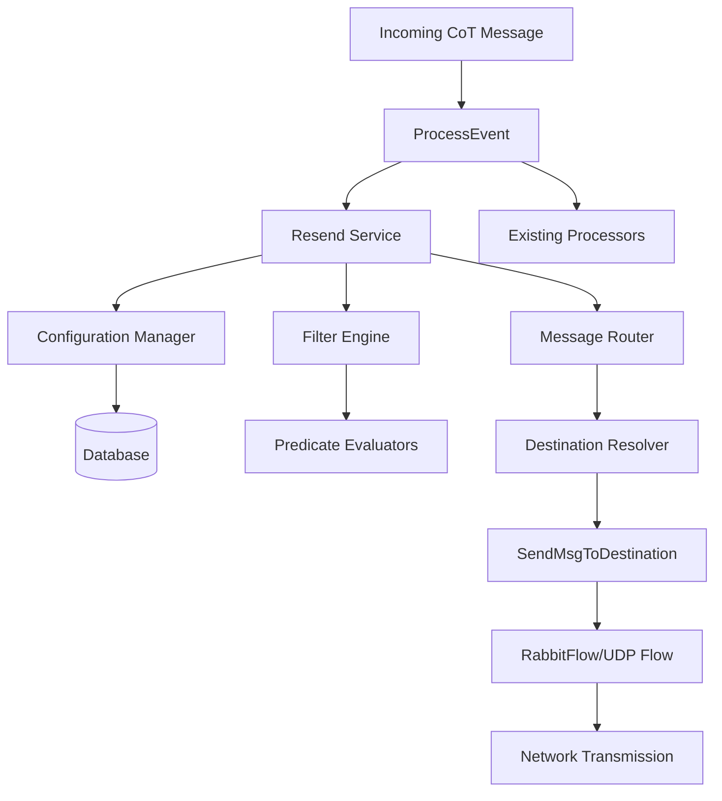

# Resend Service Architecture Plan

## 1. Analysis of Existing Message Flow

### Current Message Processing Pipeline

```
Incoming Messages
    ↓
ProcessEvent(msg *cot.CotMessage)
    ↓
Event Processors (pattern matching)
    ↓
Processor Callbacks
    ↓
Item Storage & UI Updates
```

### Current Outgoing Flow

```
SendMsg(msg *cotproto.TakMessage)
    ↓
Multiple Flows (Rabbit, UDP, etc.)
    ↓
Network Transmission
```

### Integration Points Identified

- **Entry Point**: [`ProcessEvent()`](cmd/webclient/messaging.go:20) - All incoming messages pass through here
- **Exit Point**: [`SendMsgToDestination()`](cmd/webclient/messaging.go:51) - Targeted message sending
- **Event Processors**: [`app.eventProcessors`](cmd/webclient/main.go:69) - Pattern-based message filtering
- **Flow System**: [`app.flows`](cmd/webclient/main.go:75) - Multiple protocol support

## 2. Resend Service Architecture

### Core Components



### Service Components Design

#### 2.1 ResendService

**Purpose**: Main orchestrator for resend functionality
**Location**: `internal/resend/service.go`

```go
type ResendService struct {
    db           *sql.DB
    logger       *slog.Logger
    configCache  *ConfigCache
    filterEngine *FilterEngine
    router       *MessageRouter
}

func (s *ResendService) ProcessMessage(msg *cot.CotMessage) {
    // 1. Get active configurations
    // 2. Evaluate filters for each config
    // 3. Route matching messages to destinations
}
```

#### 2.2 ConfigurationManager

**Purpose**: Manages resend configurations in memory
**Location**: `internal/resend/config_manager.go`

```go
type ConfigManager struct {
    configs map[string]*ResendConfig
    mutex   sync.RWMutex
}

func (c *ConfigManager) GetActiveConfigs() []*ResendConfig
func (c *ConfigManager) UpdateConfig(config *ResendConfig)
func (c *ConfigManager) DeleteConfig(uid string)
func (c *ConfigManager) LoadFromDatabase(db *sql.DB) error
```

#### 2.3 FilterEngine

**Purpose**: Evaluates message filters
**Location**: `internal/resend/filter_engine.go`

```go
type FilterEngine struct {
    logger *slog.Logger
}

func (f *FilterEngine) EvaluateConfig(msg *cot.CotMessage, config *ResendConfig) bool
func (f *FilterEngine) EvaluateFilter(msg *cot.CotMessage, filter Filter) bool
func (f *FilterEngine) EvaluatePredicate(msg *cot.CotMessage, predicate Predicate) bool
```

#### 2.4 MessageRouter

**Purpose**: Routes messages to configured destinations
**Location**: `internal/resend/router.go`

```go
type MessageRouter struct {
    sendToDestination func(msg *cotproto.TakMessage, dest model.SendItemDest) error
    logger           *slog.Logger
}

func (r *MessageRouter) RouteMessage(msg *cot.CotMessage, config *ResendConfig) error
func (r *MessageRouter) CreateDestination(addr NetworkAddress) model.SendItemDest
```

## 3. Filter Evaluation Engine

### Basic Filter Logic

#### 3.1 Filter Evaluation

```go
func (f *FilterEngine) EvaluateConfig(msg *cot.CotMessage, config *ResendConfig) bool {
    // OR logic: any filter matches means resend
    for _, filter := range config.Filters {
        if f.EvaluateFilter(msg, filter) {
            return true
        }
    }
    return false
}

func (f *FilterEngine) EvaluateFilter(msg *cot.CotMessage, filter Filter) bool {
    // AND logic: all predicates must match
    for _, predicate := range filter.GetPredicates() {
        if !predicate.Evaluate(msg) {
            return false
        }
    }
    return true
}
```

## 4. Message Routing and Delivery System

### Destination Resolution

#### 4.1 Network Address Mapping

```go
func (r *MessageRouter) ResolveDestination(addr NetworkAddress) model.SendItemDest {
    switch addr := addr.(type) {
    case *NodeNetworkAddress:
        return model.SendItemDest{
            Addr: addr.GetIP(),
            URN:  int(addr.GetURN()),
        }
    case *SubnetNetworkAddress:
        return model.SendItemDest{
            Addr: addr.GetIP(), // Broadcast address
            URN:  16777215,     // Broadcast URN
        }
    }
}
```

#### 4.2 Message Routing

```go
func (r *MessageRouter) RouteMessage(msg *cot.CotMessage, config *ResendConfig) error {
    dest := r.ResolveDestination(config.Destination)
    return r.sendToDestination(msg.GetTakMessage(), dest)
}
```

## 5. Configuration Management

### Simple In-Memory Cache

#### 5.1 Configuration Cache

```go
type ConfigCache struct {
    configs map[string]*ResendConfig
    mutex   sync.RWMutex
}

func (c *ConfigCache) GetActiveConfigs() []*ResendConfig {
    c.mutex.RLock()
    defer c.mutex.RUnlock()

    active := make([]*ResendConfig, 0)
    for _, config := range c.configs {
        if config.Enabled {
            active = append(active, config)
        }
    }
    return active
}

func (c *ConfigCache) UpdateConfig(config *ResendConfig) {
    c.mutex.Lock()
    defer c.mutex.Unlock()
    c.configs[config.UID] = config
}
```

#### 5.2 API Integration

```go
// Update HTTP handlers to refresh cache
func createResendConfigHandler(app *App) air.Handler {
    return func(req *air.Request, res *air.Response) error {
        // ... save to database ...

        // Update cache
        app.resendService.configManager.UpdateConfig(&configDTO)

        // ... return response ...
    }
}
```

## 6. Integration with Existing System

### 6.1 Event Processor Integration

```go
// Add resend processor to existing event processors
func (app *App) InitMessageProcessors() {
    // ... existing processors ...

    // Add resend processor - should be LAST to avoid interference
    app.eventProcessors = append(app.eventProcessors, &EventProcessor{
        name:    "resend",
        include: []string{".-"}, // Match all messages
        cb:      app.resendService.ProcessMessage,
    })
}
```

### 6.2 App Structure Updates

```go
type App struct {
    // ... existing fields ...
    resendService *resend.ResendService
}

func (app *App) Init() {
    // ... existing initialization ...

    // Initialize resend service
    if app.DB != nil {
        app.resendService = resend.NewResendService(&resend.Config{
            DB:                app.DB,
            Logger:            app.logger.With("service", "resend"),
            SendToDestination: app.SendMsgToDestination,
        })
    }
}
```

## 7. Implementation Roadmap

### Phase 1: Core Service Implementation

1. **Create ResendService struct** with basic functionality
2. **Implement ConfigurationManager** with in-memory cache
3. **Build FilterEngine** with predicate evaluation
4. **Create MessageRouter** for destination handling
5. **Integration with ProcessEvent** pipeline

### Phase 2: API Integration

1. **Update HTTP handlers** to refresh cache on config changes
2. **Load configurations** from database on startup

### Phase 3: Documentation

3. **Update documentation** with usage examples

## 8. Implementation Details

### File Structure

```
internal/resend/
├── service.go           # Main ResendService
├── config_manager.go    # Configuration management
├── filter_engine.go     # Filter evaluation
├── router.go           # Message routing
├── resend.go           # Existing interfaces (already done)
```

### Message Processing Flow

```go
func (s *ResendService) ProcessMessage(msg *cot.CotMessage) {
    configs := s.configManager.GetActiveConfigs()
    for _, config := range configs {
        if s.filterEngine.EvaluateConfig(msg, config) {
            if err := s.router.RouteMessage(msg, config); err != nil {
                s.logger.Error("failed to route message", "error", err, "config", config.UID)
            }
        }
    }
}
```

### Configuration Loading

```go
func (s *ResendService) Start() error {
    // Load configurations from database into memory cache
    return s.configManager.LoadFromDatabase(s.db)
}
```

This simplified architecture provides a clean, maintainable solution for implementing the resend functionality while integrating seamlessly with the existing GoATAK system.
