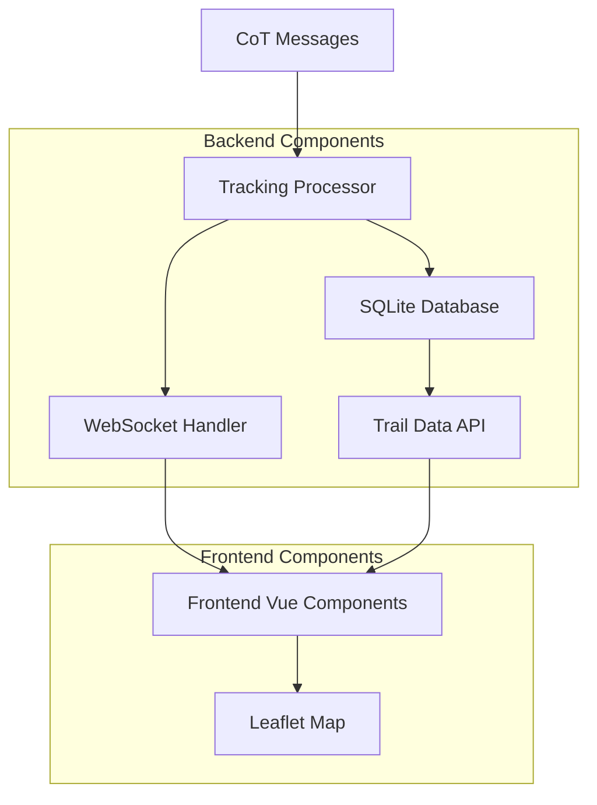
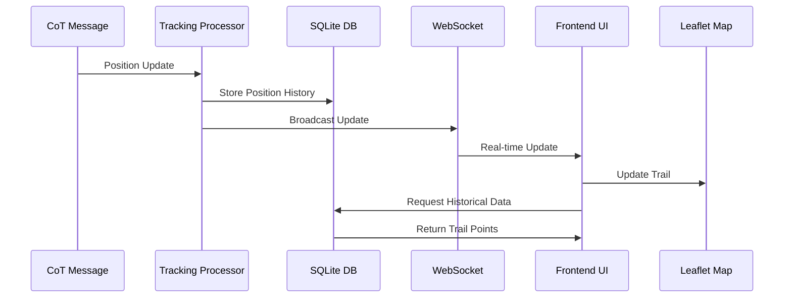

# TAK Tracking Feature Implementation Plan

## Overview

This document outlines the implementation plan for developing a "Tracking" feature in the TAK (Team Awareness Kit) client application. The feature will provide basic position tracking with breadcrumb trails for units, showing historical movement paths on the map with configurable trail length and update intervals.

## 1. Core Requirements

### 1.1 Functional Requirements
- **Real-time Position Updates**: Track unit positions as they move and update in real-time
- **Breadcrumb Trails**: Display historical movement paths as visual trails on the map
- **Configurable Trail Length**: Allow users to set how many historical points to display
- **Update Intervals**: Configurable tracking update frequency
- **Multi-entity Support**: Track multiple units simultaneously
- **Trail Visualization**: Different colors/styles for different units

### 1.2 Technical Requirements
- Integration with existing CoT (Cursor on Target) messaging protocol
- SQLite database for persistent storage of tracking data
- Vue.js frontend components for trail visualization
- Leaflet.js integration for map display
- WebSocket real-time updates

## 2. Architecture Design

### 2.1 System Components



### 2.2 Data Flow



## 3. Database Schema Design

### 3.1 Tracking Tables

```sql
-- Main tracking positions table
CREATE TABLE tracking_positions (
    id INTEGER PRIMARY KEY AUTOINCREMENT,
    unit_uid TEXT NOT NULL,
    latitude REAL NOT NULL,
    longitude REAL NOT NULL,
    altitude REAL,
    speed REAL,
    course REAL,
    timestamp DATETIME NOT NULL,
    created_at DATETIME DEFAULT CURRENT_TIMESTAMP,
    INDEX idx_unit_timestamp (unit_uid, timestamp),
    INDEX idx_timestamp (timestamp)
);

-- Tracking configuration per unit
CREATE TABLE tracking_config (
    unit_uid TEXT PRIMARY KEY,
    enabled BOOLEAN DEFAULT TRUE,
    trail_length INTEGER DEFAULT 50,
    update_interval INTEGER DEFAULT 30, -- seconds
    trail_color TEXT DEFAULT '#FF0000',
    trail_width INTEGER DEFAULT 2,
    created_at DATETIME DEFAULT CURRENT_TIMESTAMP,
    updated_at DATETIME DEFAULT CURRENT_TIMESTAMP
);

-- Global tracking settings
CREATE TABLE tracking_settings (
    key TEXT PRIMARY KEY,
    value TEXT NOT NULL,
    updated_at DATETIME DEFAULT CURRENT_TIMESTAMP
);

-- Insert default settings
INSERT INTO tracking_settings (key, value) VALUES 
    ('default_trail_length', '50'),
    ('default_update_interval', '30'),
    ('max_trail_age_hours', '24'),
    ('cleanup_interval_hours', '6');
```

### 3.2 Data Retention Policy

- **Default Trail Length**: 50 points per unit
- **Maximum Age**: 24 hours for historical data
- **Cleanup Frequency**: Every 6 hours
- **Storage Optimization**: Automatic cleanup of old tracking data

## 4. Backend Implementation

### 4.1 Go Structures

```go
// pkg/model/tracking.go
package model

import "time"

type TrackingPosition struct {
    ID        int64     `json:"id" db:"id"`
    UnitUID   string    `json:"unit_uid" db:"unit_uid"`
    Latitude  float64   `json:"latitude" db:"latitude"`
    Longitude float64   `json:"longitude" db:"longitude"`
    Altitude  float64   `json:"altitude" db:"altitude"`
    Speed     float64   `json:"speed" db:"speed"`
    Course    float64   `json:"course" db:"course"`
    Timestamp time.Time `json:"timestamp" db:"timestamp"`
    CreatedAt time.Time `json:"created_at" db:"created_at"`
}

type TrackingConfig struct {
    UnitUID        string    `json:"unit_uid" db:"unit_uid"`
    Enabled        bool      `json:"enabled" db:"enabled"`
    TrailLength    int       `json:"trail_length" db:"trail_length"`
    UpdateInterval int       `json:"update_interval" db:"update_interval"`
    TrailColor     string    `json:"trail_color" db:"trail_color"`
    TrailWidth     int       `json:"trail_width" db:"trail_width"`
    CreatedAt      time.Time `json:"created_at" db:"created_at"`
    UpdatedAt      time.Time `json:"updated_at" db:"updated_at"`
}

type TrackingTrail struct {
    UnitUID   string              `json:"unit_uid"`
    Callsign  string              `json:"callsign"`
    Positions []TrackingPosition  `json:"positions"`
    Config    TrackingConfig      `json:"config"`
}
```

### 4.2 Tracking Service

```go
// internal/tracking/service.go
package tracking

import (
    "database/sql"
    "time"
    "github.com/kdudkov/goatak/pkg/model"
)

type TrackingService struct {
    db *sql.DB
}

func NewTrackingService(db *sql.DB) *TrackingService {
    return &TrackingService{db: db}
}

func (s *TrackingService) RecordPosition(unitUID string, lat, lon, alt, speed, course float64) error {
    // Implementation for recording position
}

func (s *TrackingService) GetTrail(unitUID string, limit int) ([]model.TrackingPosition, error) {
    // Implementation for retrieving trail
}

func (s *TrackingService) GetActiveTrails() ([]model.TrackingTrail, error) {
    // Implementation for getting all active trails
}

func (s *TrackingService) UpdateConfig(config model.TrackingConfig) error {
    // Implementation for updating tracking configuration
}

func (s *TrackingService) CleanupOldData() error {
    // Implementation for cleaning up old tracking data
}
```

### 4.3 API Endpoints

```go
// cmd/webclient/tracking_handlers.go

// GET /api/tracking/trails - Get all active trails
func getTrailsHandler(app *App) air.Handler {
    return func(req *air.Request, res *air.Response) error {
        trails, err := app.trackingService.GetActiveTrails()
        if err != nil {
            return err
        }
        return res.WriteJSON(trails)
    }
}

// GET /api/tracking/trail/:uid - Get trail for specific unit
func getTrailHandler(app *App) air.Handler {
    return func(req *air.Request, res *air.Response) error {
        uid := req.Param("uid")
        trail, err := app.trackingService.GetTrail(uid, 50)
        if err != nil {
            return err
        }
        return res.WriteJSON(trail)
    }
}

// POST /api/tracking/config/:uid - Update tracking configuration
func updateTrackingConfigHandler(app *App) air.Handler {
    return func(req *air.Request, res *air.Response) error {
        uid := req.Param("uid")
        var config model.TrackingConfig
        if err := req.Bind(&config); err != nil {
            return err
        }
        config.UnitUID = uid
        return app.trackingService.UpdateConfig(config)
    }
}
```

### 4.4 CoT Integration

```go
// Integration with existing CoT message processing
func (app *App) processTrackingUpdate(msg *cot.CotMessage) {
    evt := msg.GetTakMessage().GetCotEvent()
    
    // Extract tracking data
    lat := evt.GetLat()
    lon := evt.GetLon()
    hae := evt.GetHae()
    speed := evt.GetDetail().GetTrack().GetSpeed()
    course := evt.GetDetail().GetTrack().GetCourse()
    
    // Record position if tracking is enabled for this unit
    if app.trackingService.IsTrackingEnabled(evt.GetUid()) {
        err := app.trackingService.RecordPosition(
            evt.GetUid(), lat, lon, hae, speed, course,
        )
        if err != nil {
            app.logger.Error("Failed to record tracking position", "error", err)
        }
        
        // Broadcast tracking update via WebSocket
        app.broadcastTrackingUpdate(evt.GetUid(), lat, lon, speed, course)
    }
}
```

## 5. Frontend Implementation

### 5.1 Vue.js Components

#### 5.1.1 Tracking Control Component

```javascript
// front/static/js/components/TrackingControl.js
Vue.component('tracking-control', {
    template: `
        <div class="tracking-control">
            <div class="card">
                <div class="card-header">
                    <h5>Tracking Control</h5>
                </div>
                <div class="card-body">
                    <div class="form-check">
                        <input class="form-check-input" type="checkbox" 
                               v-model="globalTrackingEnabled" @change="toggleGlobalTracking">
                        <label class="form-check-label">Enable Global Tracking</label>
                    </div>
                    
                    <div class="mt-3">
                        <label>Default Trail Length:</label>
                        <input type="range" class="form-range" min="10" max="200" 
                               v-model="defaultTrailLength" @change="updateSettings">
                        <span>{{ defaultTrailLength }} points</span>
                    </div>
                    
                    <div class="mt-3">
                        <label>Update Interval:</label>
                        <select class="form-select" v-model="updateInterval" @change="updateSettings">
                            <option value="10">10 seconds</option>
                            <option value="30">30 seconds</option>
                            <option value="60">1 minute</option>
                            <option value="300">5 minutes</option>
                        </select>
                    </div>
                </div>
            </div>
        </div>
    `,
    data() {
        return {
            globalTrackingEnabled: true,
            defaultTrailLength: 50,
            updateInterval: 30
        }
    },
    methods: {
        toggleGlobalTracking() {
            // Implementation
        },
        updateSettings() {
            // Implementation
        }
    }
});
```

#### 5.1.2 Unit Tracking Component

```javascript
// front/static/js/components/UnitTracking.js
Vue.component('unit-tracking', {
    props: ['unit'],
    template: `
        <div class="unit-tracking">
            <div class="form-check">
                <input class="form-check-input" type="checkbox" 
                       v-model="trackingEnabled" @change="toggleTracking">
                <label class="form-check-label">Track {{ unit.callsign }}</label>
            </div>
            
            <div v-if="trackingEnabled" class="mt-2">
                <div class="row">
                    <div class="col-6">
                        <label>Trail Color:</label>
                        <input type="color" class="form-control form-control-color" 
                               v-model="trailColor" @change="updateConfig">
                    </div>
                    <div class="col-6">
                        <label>Trail Length:</label>
                        <input type="number" class="form-control" min="10" max="200" 
                               v-model="trailLength" @change="updateConfig">
                    </div>
                </div>
                
                <div class="mt-2">
                    <button class="btn btn-sm btn-outline-danger" @click="clearTrail">
                        Clear Trail
                    </button>
                </div>
            </div>
        </div>
    `,
    data() {
        return {
            trackingEnabled: false,
            trailColor: '#FF0000',
            trailLength: 50
        }
    },
    methods: {
        toggleTracking() {
            // Implementation
        },
        updateConfig() {
            // Implementation
        },
        clearTrail() {
            // Implementation
        }
    }
});
```

### 5.2 Map Integration

#### 5.2.1 Trail Visualization

```javascript
// front/static/js/tracking.js
class TrackingManager {
    constructor(map) {
        this.map = map;
        this.trails = new Map(); // uid -> L.polyline
        this.trailData = new Map(); // uid -> array of positions
        this.trackingEnabled = true;
    }
    
    addTrailPoint(unitUID, lat, lon, timestamp) {
        if (!this.trackingEnabled) return;
        
        // Get or create trail data
        if (!this.trailData.has(unitUID)) {
            this.trailData.set(unitUID, []);
        }
        
        const trail = this.trailData.get(unitUID);
        trail.push({ lat, lon, timestamp });
        
        // Limit trail length
        const maxLength = this.getTrailLength(unitUID);
        if (trail.length > maxLength) {
            trail.splice(0, trail.length - maxLength);
        }
        
        this.updateTrailVisualization(unitUID);
    }
    
    updateTrailVisualization(unitUID) {
        const trail = this.trailData.get(unitUID);
        if (!trail || trail.length < 2) return;
        
        // Convert to LatLng array
        const latlngs = trail.map(point => [point.lat, point.lon]);
        
        // Get or create polyline
        if (!this.trails.has(unitUID)) {
            const polyline = L.polyline(latlngs, {
                color: this.getTrailColor(unitUID),
                weight: this.getTrailWidth(unitUID),
                opacity: 0.7
            }).addTo(this.map);
            
            this.trails.set(unitUID, polyline);
        } else {
            // Update existing polyline
            this.trails.get(unitUID).setLatLngs(latlngs);
        }
    }
    
    clearTrail(unitUID) {
        if (this.trails.has(unitUID)) {
            this.map.removeLayer(this.trails.get(unitUID));
            this.trails.delete(unitUID);
        }
        this.trailData.delete(unitUID);
    }
    
    getTrailColor(unitUID) {
        // Get from unit configuration or use default
        return '#FF0000';
    }
    
    getTrailLength(unitUID) {
        // Get from unit configuration or use default
        return 50;
    }
    
    getTrailWidth(unitUID) {
        // Get from unit configuration or use default
        return 2;
    }
}

// Integration with existing map.js
const trackingManager = new TrackingManager(app.map);

// WebSocket message handler for tracking updates
function handleTrackingUpdate(data) {
    if (data.type === 'tracking_update') {
        trackingManager.addTrailPoint(
            data.unit_uid,
            data.latitude,
            data.longitude,
            data.timestamp
        );
    }
}
```

### 5.3 WebSocket Integration

```javascript
// Extension to existing WebSocket handler in map.js
// Add to existing onmessage handler
if (parsed.type === 'tracking_update') {
    handleTrackingUpdate(parsed.data);
}

// Tracking-specific WebSocket messages
function requestTrailData(unitUID) {
    if (app.conn && app.conn.readyState === WebSocket.OPEN) {
        app.conn.send(JSON.stringify({
            type: 'get_trail',
            unit_uid: unitUID
        }));
    }
}

function updateTrackingConfig(unitUID, config) {
    fetch(`/api/tracking/config/${unitUID}`, {
        method: 'POST',
        headers: {
            'Content-Type': 'application/json'
        },
        body: JSON.stringify(config)
    });
}
```

## 6. Configuration Options

### 6.1 Global Settings

```javascript
// Default tracking configuration
const TRACKING_DEFAULTS = {
    enabled: true,
    trailLength: 50,
    updateInterval: 30, // seconds
    trailColor: '#FF0000',
    trailWidth: 2,
    maxAge: 24 * 60 * 60 * 1000, // 24 hours in milliseconds
    cleanupInterval: 6 * 60 * 60 * 1000 // 6 hours in milliseconds
};
```

### 6.2 User Interface Settings

```javascript
// UI configuration for tracking controls
const TRACKING_UI_CONFIG = {
    showTrackingPanel: true,
    showUnitTrackingControls: true,
    allowTrailColorCustomization: true,
    allowTrailLengthCustomization: true,
    maxTrailLength: 200,
    minTrailLength: 10
};
```

## 7. Integration Requirements

### 7.1 CoT Protocol Integration

- **Position Updates**: Integrate with existing CoT message processing
- **Track Data**: Extract speed/course from existing `Track` protobuf when available (Note: Track protobuf contains instantaneous movement data, while Tracking feature stores historical position trails)
- **Message Flow**: Extend current WebSocket message handling
- **Data Consistency**: Ensure tracking data aligns with unit position updates

### 7.2 Existing System Integration

- **Vue.js Components**: Follow existing component patterns
- **API Endpoints**: Use existing REST API structure
- **Database**: Extend current SQLite database
- **WebSocket**: Enhance existing WebSocket communication

## 8. Implementation Timeline

### Phase 1: Backend Foundation (Week 1)
- [ ] Database schema creation
- [ ] Tracking service implementation
- [ ] API endpoints development
- [ ] CoT integration

### Phase 2: Frontend Components (Week 2)
- [ ] Tracking control components
- [ ] Map trail visualization
- [ ] WebSocket integration
- [ ] Configuration UI

### Phase 3: Integration & Testing (Week 3)
- [ ] End-to-end integration
- [ ] Performance optimization
- [ ] User interface refinement
- [ ] Testing and bug fixes

## 9. Technical Considerations

### 9.1 Performance
- **Database Indexing**: Proper indexing on unit_uid and timestamp
- **Memory Management**: Limit in-memory trail data
- **Update Throttling**: Prevent excessive database writes
- **Cleanup Automation**: Regular cleanup of old tracking data

### 9.2 Data Management
- **Storage Efficiency**: Compress old tracking data
- **Retention Policies**: Configurable data retention
- **Backup Strategy**: Include tracking data in backups
- **Migration Support**: Database schema migration support

### 9.3 User Experience
- **Visual Performance**: Smooth trail animations
- **Responsive Design**: Mobile-friendly tracking controls
- **Accessibility**: Keyboard navigation support
- **Error Handling**: Graceful degradation when tracking fails

## 10. Future Enhancements

### 10.1 Advanced Features (Future Phases)
- **Track Analysis**: Distance traveled, time in areas
- **Historical Playback**: Replay unit movements over time
- **Track Filtering**: Filter trails by time, unit type, etc.
- **Export Capabilities**: Export tracking data to KML/GPX
- **Geofencing Integration**: Track entry/exit from defined areas

### 10.2 Performance Optimizations
- **Data Compression**: Compress historical tracking data
- **Caching Strategy**: Cache frequently accessed trails
- **Progressive Loading**: Load trails on demand
- **WebGL Rendering**: Hardware-accelerated trail rendering

## 11. Testing Strategy

### 11.1 Unit Tests
- Tracking service methods
- Database operations
- Configuration management
- Trail data processing

### 11.2 Integration Tests
- CoT message processing
- WebSocket communication
- API endpoint functionality
- Database schema validation

### 11.3 User Acceptance Tests
- Trail visualization accuracy
- Configuration persistence
- Performance under load
- Cross-browser compatibility

---

This implementation plan provides a comprehensive roadmap for developing the tracking feature while maintaining compatibility with the existing TAK system architecture and following the established patterns for Vue.js components, Go backend services, and SQLite database integration.