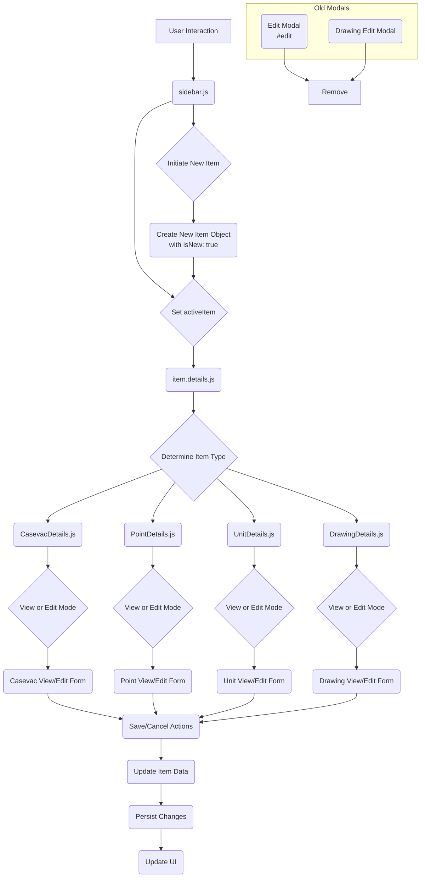

# Modular Sidebar Design for Item Details

## 1. Introduction

This document outlines the design for refactoring the item details and editing functionality within the TAK web client to utilize a modular sidebar approach. Currently, the application uses a combination of a sidebar for viewing some item details (Casevac) and modals for viewing/editing other item types (Points, Units, Drawings). The goal is to consolidate all item details and editing into the sidebar for a more consistent and streamlined user experience.

## 2. Current State Analysis

Based on the review of the provided files:

-   [`front/static/js/components/item.details.js`](front/static/js/components/item.details.js): This component acts as a dynamic loader for different item detail components based on the item's category and type. It already supports `casevac-details`, `drawing-details`, `point-details`, and `unit-details`. It has the basic structure to switch between different item detail views in the sidebar.
-   [`cmd/webclient/templates/map.html`](cmd/webclient/templates/map.html): This file contains the main HTML structure, including the map, the sidebar component (`<sidebar>`), and several modal definitions. Crucially, it includes the `#edit` modal used for editing Points and Units, and references `drawing-edit-modal`. This confirms that editing for Points, Units, and Drawings is currently handled outside the modular sidebar flow.
-   [`front/static/js/components/sidebar.js`](front/static/js/components/sidebar.js): This component manages the sidebar tabs and the `activeItem`. It handles the display of item details via the `ItemDetails` component and includes logic for creating a new casevac item. It needs to be enhanced to handle the initiation of editing for all item types.
-   [`front/static/js/components/CasevacDetails.js`](front/static/js/components/CasevacDetails.js): This component already implements both view and edit modes for Casevac items within the sidebar. It serves as a good example for how other item detail components should be structured.
-   [`front/static/js/components/PointDetails.js`](front/static/js/components/PointDetails.js): This component has both view and edit modes implemented, similar to `CasevacDetails.js`.
-   [`front/static/js/components/UnitDetails.js`](front/static/js/components/UnitDetails.js): This component also has both view and edit modes implemented, similar to `CasevacDetails.js`.
-   [`front/static/js/components/DrawingDetails.js`](front/static/js/components/DrawingDetails.js): This component has both view and edit modes implemented, similar to `CasevacDetails.js`.
-   `#edit` modal in [`cmd/webclient/templates/map.html`](cmd/webclient/templates/map.html): This modal handles the editing of Points and Units. It uses a single form with conditional fields based on item category. The logic for handling different fields and interacting with the main application state needs to be migrated to `PointDetails.js` and `UnitDetails.js`.
-   [`front/static/js/components/drawing.edit.modal.js`](front/static/js/components/drawing.edit.modal.js): This modal handles the editing of Drawings. The editing logic and form fields need to be fully integrated into `DrawingDetails.js`.

## 3. Proposed Design

The proposed design involves leveraging the existing structure of the item detail components (`CasevacDetails.js`, `PointDetails.js`, `UnitDetails.js`, `DrawingDetails.js`) which already support both view and edit modes. The core changes will focus on migrating the editing logic and UI from the modals into these components and updating the `sidebar.js` to manage the state and interaction with these components.

### 3.1 Component Responsibilities

-   **`sidebar.js`**:
    -   Manage the active item (`activeItem`) displayed in the sidebar.
    -   Handle the initiation of creating a *new* item (Point, Unit, Drawing, Casevac). This will involve creating a new item object with default values and setting it as the `activeItem`.
    -   Handle the selection of an *existing* item for viewing/editing. This will involve setting the selected item as the `activeItem`.
    -   Control the display of the `ItemDetails` component.
    -   Potentially manage a global editing state or pass down a prop to `ItemDetails` to indicate if the sidebar is in "create new item" mode.

-   **`item.details.js`**:
    -   Continue to act as a dynamic loader, rendering the appropriate detail component based on the `activeItem`'s type and category.
    -   Pass the `item` data and necessary methods (like `deleteItem`, `onDone`) to the specific detail component.

-   **`CasevacDetails.js`, `PointDetails.js`, `UnitDetails.js`, `DrawingDetails.js`**:
    -   Each component will be responsible for rendering both the view and edit forms for its specific item type.
    -   The `editing` data property within each component will control which form is displayed.
    -   The `startEditing` method will be called when a new item of that type is created or an existing item is selected for editing.
    -   The `saveEditing` method (or `sendCasevac` for Casevac) will handle saving the edited data. This method will need to interact with the application's data store or API to persist the changes. The logic currently in the modal's save functions (`saveEditForm`, `cancelEditForm`) will be moved into these components' `saveEditing` and `cancelEditing` methods.
    -   The specific form fields and validation logic from the modals will be integrated into the edit templates of these components. For `UnitDetails.js`, the complex subtype selection logic from the `#edit` modal will need to be implemented. For `DrawingDetails.js`, the geofence options will need to be correctly handled in the edit form.

### 3.2 Data Flow

1.  User initiates creation of a new item (e.g., clicks a "Add Point" button in the sidebar tools) or selects an existing item on the map/list.
2.  `sidebar.js` updates its `activeItem` data property with the new or selected item object. If it's a new item, a flag like `isNew: true` can be added.
3.  `sidebar.js` ensures the "Item Details" tab is active.
4.  `item.details.js` observes the `activeItem` prop and dynamically renders the appropriate detail component (`PointDetails`, `UnitDetails`, etc.).
5.  The specific detail component receives the `item` prop. If `item.isNew` is true (or if an "Edit" button is clicked for an existing item), the component sets its internal `editing` data property to `true` and copies the item data to its `editingData` property to start the editing mode.
6.  The user interacts with the edit form within the sidebar component.
7.  When the user clicks "Save", the `saveEditing` method in the detail component is called. This method updates the item data and sends it to the backend (via a shared service or direct API call).
8.  When the user clicks "Cancel", the `cancelEditing` method is called, discarding any changes and switching back to the view mode. If it was a new item, this might also involve clearing the `activeItem` in `sidebar.js`.

### 3.3 UI Changes

-   The `#edit` modal in [`cmd/webclient/templates/map.html`](cmd/webclient/templates/map.html) will be removed.
-   The `drawing-edit-modal` component and its usage will be removed.
-   The edit forms currently in the modals will be integrated into the templates of `PointDetails.js`, `UnitDetails.js`, and `DrawingDetails.js`, displayed conditionally based on the `editing` state.
-   Buttons or actions to initiate the creation of new items (Point, Unit, Drawing, Casevac) will be added to the sidebar, likely within the "Tools" tab or a dedicated "Create" section.

## 4. Implementation Steps (for the AI Agent)

1.  **Refactor `PointDetails.js`**:
    -   Review the edit form fields and logic in the `#edit` modal in [`cmd/webclient/templates/map.html`](cmd/webclient/templates/map.html) relevant to Points.
    -   Ensure all necessary fields (callsign, type, color, remarks, send) and their data bindings (`v-model`) are present and correctly implemented in the edit form template of `PointDetails.js`.
    -   Verify that the `saveEditing` method in `PointDetails.js` correctly updates the item data and handles persistence (this might require integrating logic from the main Vue instance's `saveEditForm`).
    -   Ensure the `cancelEditing` method correctly discards changes and switches back to view mode.

2.  **Refactor `UnitDetails.js`**:
    -   Review the edit form fields and logic in the `#edit` modal in [`cmd/webclient/templates/map.html`](cmd/webclient/templates/map.html) relevant to Units.
    -   Ensure all necessary fields (callsign, category - though this will be implicit in `UnitDetails`, affiliation, subtype with navigation, remarks, web_sensor, send) and their data bindings are present and correctly implemented in the edit form template of `UnitDetails.js`.
    -   Implement the subtype selection logic, including the use of `root_sidc` and the navigation buttons, within `UnitDetails.js`. This might require accessing or replicating the `getSidc` and `getRootSidc` functions used in the modal.
    -   Verify that the `saveEditing` method in `UnitDetails.js` correctly updates the item data and handles persistence.
    -   Ensure the `cancelEditing` method correctly discards changes and switches back to view mode.

3.  **Refactor `DrawingDetails.js`**:
    -   Review the edit form fields and logic in `drawing.edit.modal.js`.
    -   Ensure all necessary fields (callsign, send, color, geofence, geofence_aff) and their data bindings are present and correctly implemented in the edit form template of `DrawingDetails.js`.
    -   Verify that the `saveEditing` method in `DrawingDetails.js` correctly updates the item data and handles persistence.
    -   Ensure the `cancelEditing` method correctly discards changes and switches back to view mode.

4.  **Update `sidebar.js`**:
    -   Modify the logic that handles item selection to set the `activeItem` and potentially trigger the `startEditing` method in the relevant detail component if the intention is to edit.
    -   Add new functionality (e.g., methods and UI elements) to initiate the creation of new Points, Units, and Drawings. This will involve creating a new item object with default properties and setting it as the `activeItem` with an `isNew: true` flag.
    -   Adjust the `casevacLocation` watcher to align with the new item creation flow if necessary.

5.  **Clean up old modal code**:
    -   Remove the HTML for the `#edit` modal from [`cmd/webclient/templates/map.html`](cmd/webclient/templates/map.html).
    -   Remove the `drawing-edit-modal` component file (`front/static/js/components/drawing.edit.modal.js`) and any references to it in `map.html` or other files.
    -   Remove any related JavaScript logic in `map.js` (or the main Vue instance) that was specifically for managing the `#edit` or `drawing-edit` modals (e.g., `form_unit` data property, `cancelEditForm`, `saveEditForm`, and functions related to opening/closing these modals).

## 5. Mermaid Diagram

## 6. Conclusion

This design proposes a clear path to refactor the item details and editing functionality into a modular sidebar, improving consistency and user experience. The existing component structure provides a solid foundation, and the implementation will primarily involve migrating logic from the old modal components into the dedicated item detail components and updating the sidebar to manage the overall flow.